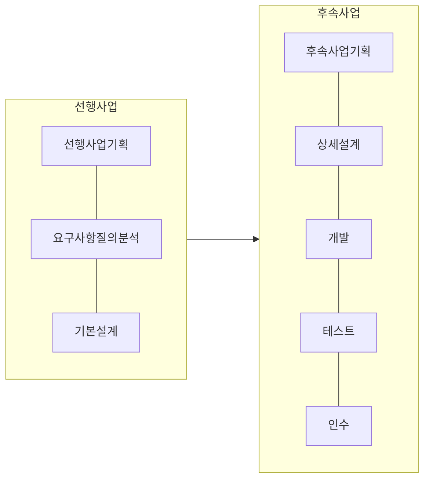

## 소프트웨어 사업의 단계별 발주제도 개념

- 정보기술용역을 구성하는 SW, HW, 시스템 개발 등을 일괄 발주하지 않고 ==선행, 후속 사업 2단계==로 분석, 설계를 우선 실시하고, 산출물에 의거하여 구현 사업을 수행하는 제도
- 단계별 요구사항 명확화, 단계별 예산 효율적 관리, ==설계와 구현 분리==로 인한 품질 향상

## 소프트웨어 사업의 단계별 발주제도 절차도, 세부 내용

### 소프트웨어 사업의 단계별 발주제도 절차도

### 소프트웨어 사업의 단계별 발주제도 세부 내용

| 구분 | 표준 프로세스 | 주요 산출물 |
| --- | --- | --- |
| 선행사업 | 요구사항 질의, 분석 | 요구사항 명세서, Use Case 시나리오 |
| | 기본설계 (논리적) | 기본 설계서 |
| 후속사업 | 상세설계 (물리적) | DB설계서, 테스트 명세서 |
| | 개발 | 코드, 단위모듈 설계서, 테스트 시나리오 |
| | 테스트 | 테스트 결과서, 품질 검토서 |
| | 인수 | 인수 계획서, 설치 결과서, 시범운영계획서 |

## 소프트웨어 사업의 단계별 발주제도, 일괄 발주 비교

| 구분 | 단계별 발주 | 일괄 발주 |
| --- | --- | --- |
| 특징 | 설계와 구현 분리 발주 | 설계와 구현 일괄 발주 |
| 리스트 관리 | 단계별 리스크 식별, 관리 | 프로젝트 전체 리스크 관리 |
| 참여업체 수 | 다수 업체 | 동일 업체 |
| 발주 행정부담 | 복수사업자 선정에 따른 행정 절차 부담 증가 | 단일 사업자 수행으로 행정 절차 감소 |
| 시스템 통합 책임 | 별도 시스템 통합 사업자 선정 | 구축 사업자가 통합 책임 |

## 소프트웨어 사업의 단계별 발주시 고려사항

- 다수업체 발주로 인한 프로젝트관리, 품질관리를 위해 PMO, QMO 도입 검토 필요
