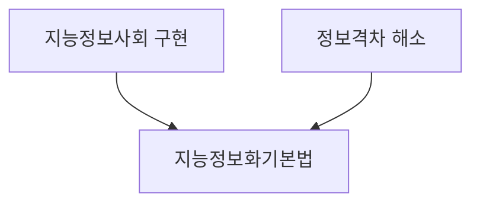

## 지능정보화 기본법 개념

- 지능정보사회 구현에 기여하여 국가경쟁력을 확보하고, 디지털 역기능 방지 등 정보격차를 해소하여 국민의 삶의 질을 높이기 위한 법률

## 지능정보화 기본법 주요조항, 개정내용

### 지능정보화 기본법 주요조항

| 주요조항                  | 내용                                           | 비고          |
| ------------------------- | ---------------------------------------------- | ------------- |
| 지능정보사회 기본원칙     | 인간존엄, 국가경제발전, 삶의질, 안전, 개인정보 | 구현가치      |
| 국가, 지자체의 책무       | 구현시책 강구, 규제 개선                       | 역할과 책임   |
| 지능정보사회 종합계획수립 | 효율적 추진을 위한 전략                        | 3년 단위 수립 |
| 지능정보사회 실행계획수립 | 세부적인 실행계획수립                          | 매년 실행     |

### 지능정보화 기본법 개정내용

| 개정조항                     | 내용                                | 비고        |
| ---------------------------- | ----------------------------------- | ----------- |
| 장애인, 고령자 접근성 보장   | 무인정보단말기, 전자출판물 추가     | 역기능 완화 |
| 무인정보단말기 이용편의 제공 | 설치운영자 보조 인력배치, 음성 안내 | 접근성 개선 |
| 과태료 부과                  | 시정명령 미이행시 과태료            | 제제 강화   |

## 지능정보화기본법 발전방향

- 기술발전에 따른 법 개정
- 국제 협력 강화
- 정보격차 해소, 역기능 방지

## 참조

- [국가법령정보센터: 지능정보화 기본법](https://law.go.kr/%EB%B2%95%EB%A0%B9/%EC%A7%80%EB%8A%A5%EC%A0%95%EB%B3%B4%ED%99%94%EA%B8%B0%EB%B3%B8%EB%B2%95/)
