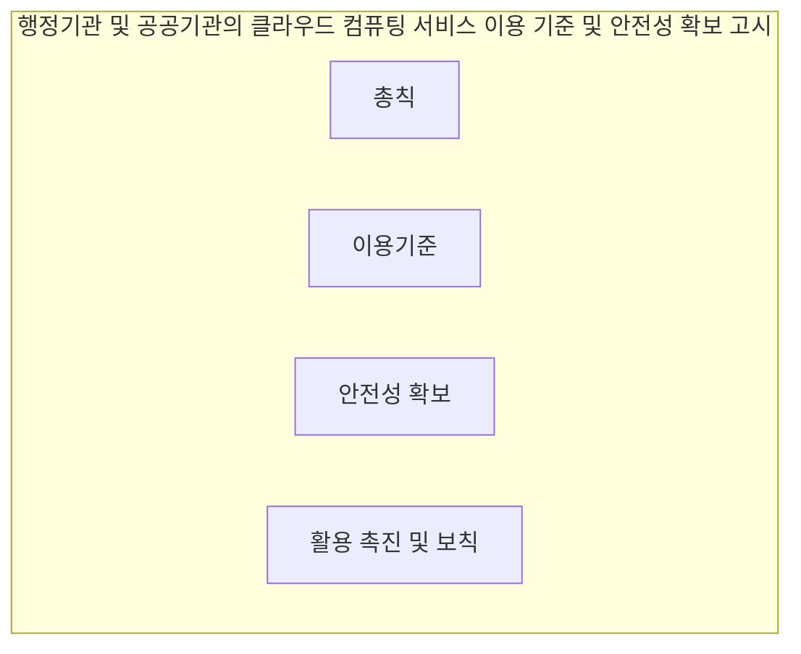

## 행정기관 및 공공기관의 클라우드 컴퓨팅 서비스 이용 기준 및 안전성 확보 등에 관한 고시 개념

- 클라우드 컴퓨팅 서비스의 계약, 이용, 안전성 검토 및 정보 보호 등의 내용을 포함하는 행정기관과 공공기관이 클라우드 컴퓨팅 서비스를 이용할 때 필요한 기준과 안전성 확보 방법을 규정하는 고시
- 전자정부법 제54조의2, ==안전성과 효율성 확보==, 이용계약의 체결 및 종료 과정에서 정보의 반환 및 파기 방법 등을 명확히 규정하여 ==정보 보안과 데이터 보호 강화==, 클라우드 컴퓨팅 서비스의 이용 촉진 ==공공부문 디지털 전환 가속==

## 행정기관 및 공공기관의 클라우드 컴퓨팅 서비스 이용 기준 및 안전성 확보 등에 관한 고시 구성도, 서비스 운영 분야 안전성 검토 항목, 적용방안

### 구성도

### 서비스 운영 분야 안전성 검토 항목

| 구분 | 항목 | 내용 |
| --- | --- | --- |
| 필수 검토 항목 | 보안성 | 서비스 제공자의 클라우드컴퓨팅서비스가 보안인증을 받았는지 여부 |
| - | 안정성 | 서비스 제공자의 재해복구 계획 및 데이터 백업 시스템의 유효성 |
| - | 법적 준수 | 관련 법률 및 규제 준수 여부 확인|
| 선택 검토 항목 | 확장성 | 서비스 제공자의 인프라가 향후 확장을 수용할 수 있는지 여부 |
| - | 비용 효율성 | 서비스 이용에 따른 비용 절감 효과 및 경제적 효율성 검토  |

### 적용방안

| 구분 | 적용방안 | 비고 |
| --- | --- | --- |
| 관리적 측면  | 경쟁 입찰 및 수의계약 방식 활용  | 계약 방법 준수 |
| - | 계약 종료 30일 전 통지 및 데이터 반환/파기 방법 안내  | 필수 적용 |
| - | 이용 정보를 범정부 EA포털에 등록 및 관리   | 30일 이내 |
| - | 3년마다 고시의 법령과 현실 여건 변화 검토  | 정기적 재검토 필요 |
| 기술적 측면  | 클라우드 컴퓨팅 서비스의 보안성 및 안전성 정기 점검  | 주기적 점검 필요  |
| - | 데이터 반환 및 파기 시 암호화하여 안전하게 전송 | 정보보호 강화|
| - | 재난, 재해 또는 서비스 중단 상황 대비 서비스 연속성 확보 계획 수립  | 서비스 안정성 확보 |
| - | 재해 시 업무 연속성을 위한 재해복구 서비스 활용 | 재해 대비|
| - | 행정기관의 특성에 맞는 클라우드 서비스 활용 모델 개발 및 보안 요건 협의  | 맞춤형 서비스 도입 |
| - | 클라우드 서비스 구현 시 행정적, 재정적, 기술적 지원 제공  | 지원 방안 마련|

## 행정기관 및 공공기관의 클라우드 컴퓨팅 서비스 이용 기준 및 안전성 확보 등에 관한 고시 고려사항

- 재난 및 재해 상황에 대비하여 서비스 연속성을 확보하기 위해 BCP, DRP 진행
