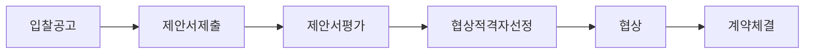
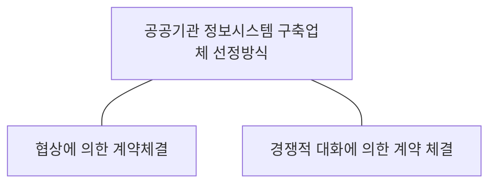

## 협상에 의한 계약체결 방식 개념

- ==국가계약법 제 43조==에 따라 입찰자가 제출한 제안서를 ==기술 능력과 입찰 가격을 기준==으로 종합 평가 후 협상하여 최종 낙찰자를 결정하는 방식
- 기술이 우수한 사업자 선정 가능, 협상을 통한 요구사항 조절 가능, 복잡하고 다양한 기술적 요구 사업 적합

## 협상에 의한 계약체결 방식 절차, 세부 내용

### 협상에 의한 계약체결 방식 절차

### 협상에 의한 계약체결 방식 세부 내용

| 구분 | 절차 | 내용 |
| --- | --- | --- |
| 사업 발주 | 입찰 공고 | 사업명, 내용, 기간, 예산 명시 |
| | 제안서 제출 | 과업 내용, 요구사항, 계약조건 명시 |
| 사업자 선정 | 제안서 평가 | 기술 능력과 입찰가 종합 평가 |
| | 협상 적격자 선정 | 기술 능력 평가 고득점 순 |
| | 협상 | 사업 내용, 이행 방법, 일정 협상 |
| | 계약체결 | 협상 완료 후 10일 이내 체결 |

## 공공기관 정보시스템 구축업체 산정방식

### 공공기관 정보시스템 구축업체 선정방식 관계도

### 공공기관 정보시스템 구축업체 선정방식 비교

| 구분 | 협상에 의한 계약 체결 | 경쟁적 대화에 의한 계약 체결 |
| --- | --- | --- |
| 근거 | 국가계약법 제 43조 2 | 국가계약법 제 43조 3 |
| 대상 | 기술력, 가격 모두 중요한 경우 | 요구사항 불명확, 기술적 해결방안이 다양한 경우 |
| 주요 절차 | ==제안서 평가, 협상, 계약 체결== | ==대화 단계==, 제안서 평가, 협상, 계약 체결 |
| 평가 요소 | 기술 능력, 입찰 가격 | 기술적 제안, 대화 결과, 가격 |

## 협상에 의한 계약체결 진행시 고려사항

- 과업 내용 변경으로 인한 하도급 대금 지급 비율 변경 가능성을 고려한 예산 반영 필요
