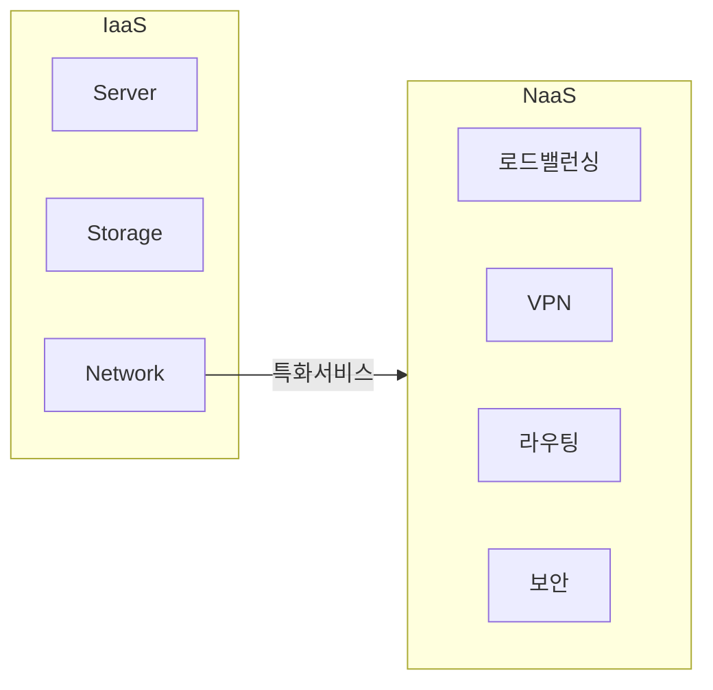

## NaaS의 개념

- 네트워크 인프라를 가상화하고 필요에 따라 동적으로 할당하여 사용자가 네트워크 인프라를 관리하지 않고도 필요한 네트워크 기능을 사용할 수 있게하는 클라우드 서비스 모델

## NaaS 서비스 구성도, 카테고리, SLA지표

### NaaS 서비스 구성도

### NaaS 서비스 카테고리

### NaaS 서비스 SLA 지표

## NaaS와 IaaS 비교

## NaaS 도입시 고려사항
