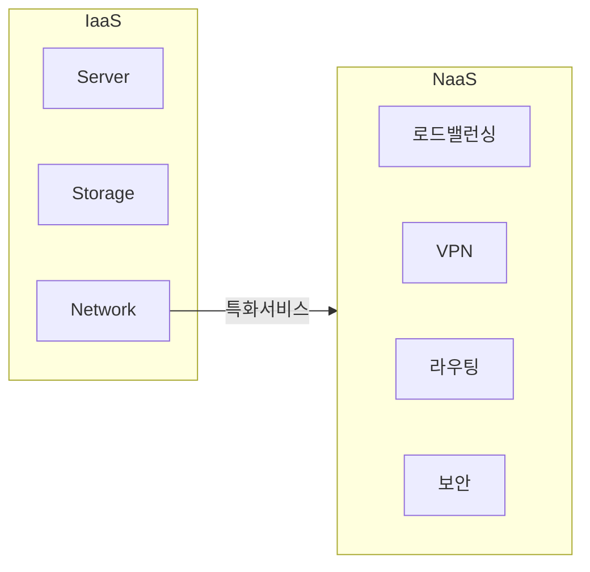

## NaaS의 개념

- **네트워크 인프라를 가상화**하고 필요에 따라 **동적으로 할당**하여 사용자가 네트워크 인프라를 관리하지 않고도 필요한 네트워크 기능을 사용할 수 있게하는 **클라우드 서비스 모델**

## NaaS 서비스 구성도, 카테고리, SLA지표

### NaaS 서비스 구성도

### NaaS 서비스 카테고리

| 구분       | 내용                       | 비고                  |
| ---------- | -------------------------- | --------------------- |
| **로드밸런싱** | 서버 간 트래픽 분산        | 안정성, 가용성        |
| **VPN**        | 가상 사설망 제공           | 원격근무, 본사-지사망 |
| **라우팅**     | 대역폭 조절, 사설망 라우팅 | VPC                   |
| **보안**       | 접근제어, DDoS 방어        | 방화벽, IPS, IDS      |

### NaaS 서비스 SLA 지표

| 구분      | 내용                                     | 비고               |
| --------- | ---------------------------------------- | ------------------ |
| 가용성    | 서비스가 사용 가능한 시간의 비율         | 99.9% 이상         |
| 응답 시간 | 요청에 대한 응답이 이루어지는 시간       | 1ms 이하           |
| 처리량    | 네트워크를 통해 전송되는 데이터의 양     | 초당 메가비트 Mbps |
| 복구 시간 | 장애 발생 시 서비스 복구에 소요되는 시간 | 1시간 이내         |

## NaaS와 IaaS 비교

| 구분      | NaaS                            | IaaS                                          |
| --------- | ------------------------------- | --------------------------------------------- |
| 개념      | 네트워크 인프라를 서비스로 제공 | 컴퓨팅 리소스(서버, 스토리지)를 서비스로 제공 |
| 주요 기능 | 가상 네트워크, VPN, VPC, WAN    | 최적화 가상 머신, 스토리지, 네트워크          |
| 유연성    | 네트워크 구성의 동적 변경 가능  | 컴퓨팅 자원의 동적 확장 가능                  |
| 관리 부담 | 네트워크 관리 최소화            | 인프라 관리 최소화                            |

## NaaS 도입시 고려사항

| 구분   | 내용                                   | 비고          |
| ------ | -------------------------------------- | ------------- |
| 관리적 | SLA 조건 검토                          | 안정성        |
| 기술적 | 네트워크 성능, 보안 프로토콜 사용 검토 | 성능 및 보안  |
| 물리적 | 데이터센터 위치, NW 물리 접근성        | 지리적 접근성 |
