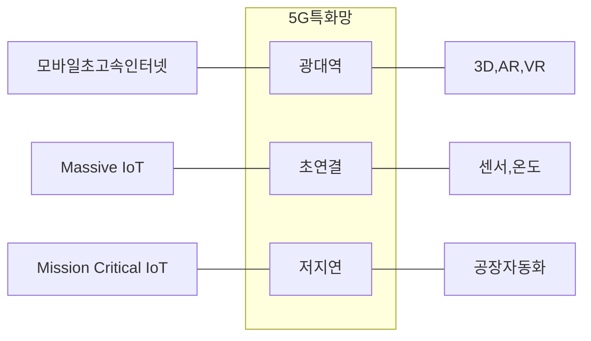

## 5G 특화망 개념

- 기업사업자가 건물, 토지, 시설 등 제한된 범위 내에서 5G 서비스를 이용하기 위해 기업 맞춤형 무선 네트워크를 구축하는 기술
- 맞춤형 서비스, 보안 강화, 효율적인 자원 관리

## 5G 특화망 네트워크 슬라이싱, 구성기술, 적용사례

### 5G 특화망 네트워크 슬라이싱

- 하나의 네트워크 안에서 논리적으로 분리하여 각각의 가상 네트워크에 필요한 성능과 자원(대역폭, QoS) 제공

### 네트워크 슬라이싱 구성 기술

| 구분 | 개념도 | 내용 |
| --- | --- | --- |
| SDN | 어플리케이션, 컨트롤플레인, 데이터플레인 | 데이터 전달 기능과 제어기능을 분리하여 OpenFlow를 통해 SW로 제어하는 네트워크 |
| NFV | 스위치,라우터 --- 가상화 --- VNFs, MANO | 네트워크 기능을 추상화하여 SW적으로 제어가 가능하도록 하는 기술 |
| - | - | Virtual Network Functions, Management and Orchestration |

### 5G 특화망 적용사례

| 구분 | 내용 | 비고 |
| --- | --- | --- |
| 국내 | 스마트팩토리 생산 자동화 | LG CNS |
| - | 자율주행 C-V2X 네트워크 | 현대자동차 |
| 국외 | 공항 수하물 추적, 보안 검색 | 두바이 공항 |
| - | 항만 자동화, 크레인 제어 | 함부르크 항만 |

##
