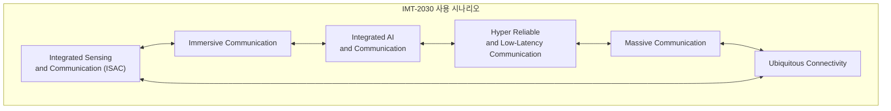
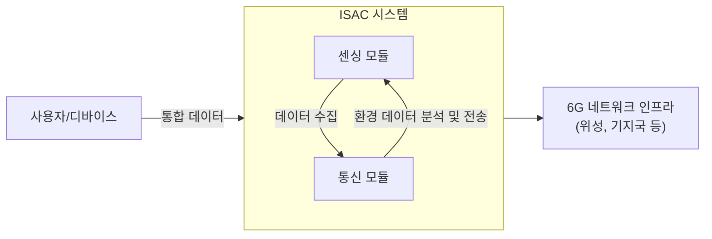

## 6G 센싱, 통신 통합 기술 개념

### ISAC 개념

- 센싱과 통신을 단일 플랫폼에서 통합적으로 수행하여 데이터 전송과 환경 감지 기능을 동시에 제공하는 기술
- IMT-2030의 주요 사용 시나리오 중 하나로, 초연결 네트워크(ubiquitous connectivity)와 신뢰성 높은 저지연 통신(hyper-reliable and low-latency communication) 등과 함께 6G의 핵심 기술

### ISAC 필요성

| 구분 | 필요성 | 내용 |
| --- | --- | --- |
| 고정밀성 | 초정밀 데이터 요구 증가 | 높은 주파수 대역 활용으로 환경 인지와 통신 정확성을 동시에 실현 |
| 자율성 | 통합적 네트워크 관리 | IoT, 자율주행 등 다양한 서비스에서 실시간 통합 관리 요구 충족 |
| 효율성 | 자원 활용 최적화 | 통신과 센싱 자원의 통합적 사용으로 비용 절감과 에너지 효율성 증대 |

## ISAC 시스템 개념도, 기술과제, 기술동향

### ISAC 시스템 개념도

- ISAC 시스템 구축을 위해 E-MIMO, 빔포밍, 정밀 포지셔닝 기술 연구 필요

### ISAC 시스템 기술과제

| 과제 | 내용 | 해결방안 |
| --- | --- | --- |
| 간섭 문제 | 센싱 및 통신 신호의 상호 간섭 발생 | 빔포밍 기술과 자원 스케줄링을 통한 신호 간섭 최소화 |
| 채널 모델 부재 | 통신과 센싱 신호를 동시에 고려하는 통합 채널 모델 부족 | 통합 신호 특성을 반영한 채널 모델 개발 및 AI 기반 채널 분석 기술 활용 |
| 성능 최적화 | 통신과 센싱 간의 트레이드오프 | LoS/NLoS 경로 최적화와 자원 분배 알고리즘 적용 |

- Line-of-Sight, Non-Line-of-Sight

### ISAC 시스템 기술동향

| 구분 | 기술동향 | 내용 |
| --- | --- | --- |
| 국내 | 6G ISAC 초기 연구 | 대학 및 연구소 중심으로 ISAC 기반 자율주행, 스마트시티 응용 연구 진행 |
| | 표준화 참여 | 3GPP, IEEE 등 국제 표준화 작업에 국내 기업(통신사, 제조사) 참여 확대 |
| 국외 | Nokia/Hexa-X | 6G 네트워크를 센서로 활용, JCAS(Joint Communication and Sensing) 기술 개발 |
| | Huawei/ZTE | 테라헤르츠 대역 기반의 고해상도 센싱 및 통신 통합 연구 진행 |
| | Qualcomm | 초정밀 위치 추적 및 RF 센싱 기술 상용화 |

## ISAC 시스템 고려사항

| 구분 | 고려사항 | 내용 |
| --- | --- | --- |
| 기술적 | 간섭 완화 |센싱과 통신 신호의 간섭 문제 해결을 위한 신호 처리 기술 필요 |
| 경제적 | 비용 효율성 | 네트워크 자원의 통합적 사용으로 CAPEX/OPEX 절감 |
| 확장성 | 서비스 적용 가능성 | 자율주행, 환경 모니터링 등 다양한 응용 분야에서 상용화 가능성 고려 |

## 참조

- [IITP: 주간기술동향 2156호](https://iitp.kr/kr/1/knowledge/periodicalViewA.it?searClassCode=B_ITA_01&masterCode=publication&identifier=1341)
