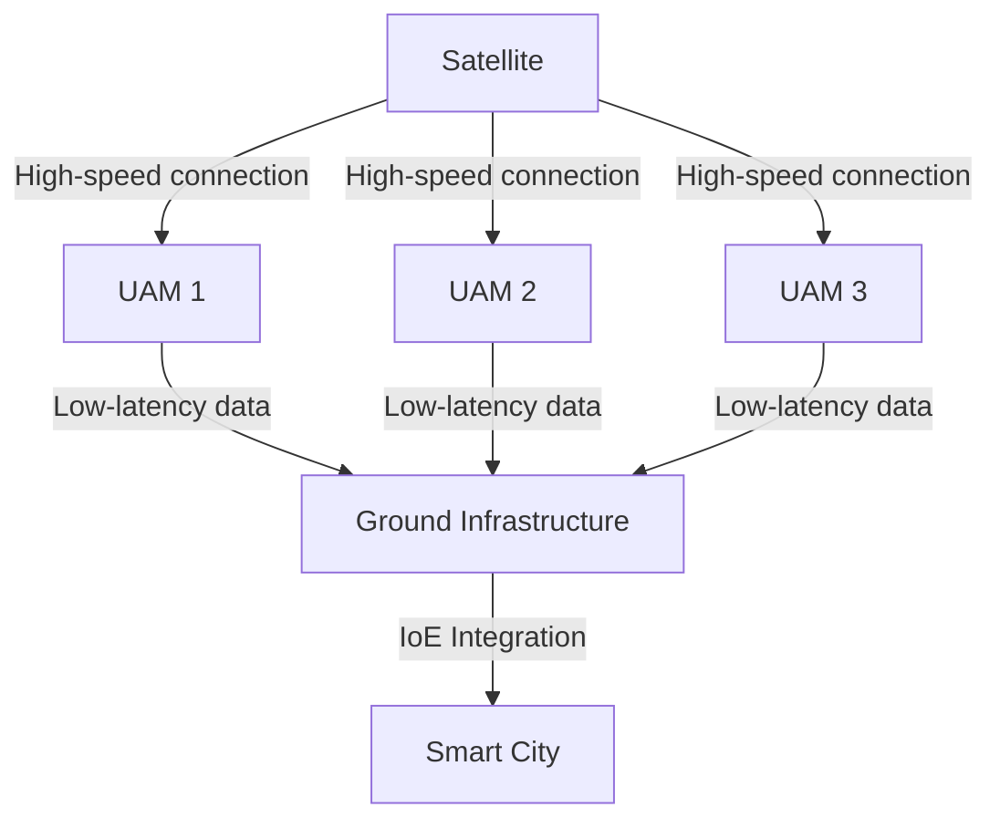

## UAM 개요

### UAM 개념

- 도심 내에서 개인용 항공기(PAV)와 드론 등의 항공기를 기존 교통 인프라에 통합하여 혁신적인 교통 서비스를 제공하는 시스템
- 교통 혼잡 해소, 고속 이동성 제공, eVTOL(Electric Vertical Take-Off and Landing Aircraft)

### UAM에서의 6G 사용 필요성

| 구분 | 필요성 | 내용 |
| --- | --- | --- |
| 통신 신뢰성 | 실시간 데이터 전송 | 초저지연(0.1ms)과 초고속 데이터 전송(최대 1Tbps)을 지원하여 항공기 간 충돌 방지 및 관제 가능 |
| 초연결성 | IoE 통합 | 항공기와 지상 인프라, 위성 통신을 연결하여 도시 교통을 완벽히 통합 가능 |
| 안전성 | 저궤도 위성 통신 연계 | 도심 항공 교통망에서 신뢰성과 안정성을 강화하여 충돌 방지와 경로 최적화 실현 |

## 6G, UAM의 융합

### 6G UAM 개념도

### 6G UAM 구성요소

| 구분 | 내용 | 비고 |
| --- | --- | --- |
| 통신 네트워크 | 고속 데이터 전송 및 초저지연 실현 | 지상 기지국, 저궤도 위성, 항공기 간 통신 |
| AI 및 엣지 컴퓨팅 | 엣지 컴퓨팅을 통한 지연 감소 및 AI 기반 자동화 | 안전항법, 충돌방지, 경로 최적화 |
| 센서 및 IoE | 안전성과 운영 효율성 향상을 위한 실시간 데이터 제공 | V2X, 기상 데이터, 교통 상황 센싱 |

### 6G UAM 활용사례

| 구분 | 사례 | 내용 |
| --- | --- | --- |
| 스마트시티 | 도시 항공 교통과 지상 교통 통합 | 6G 통신의 실시간 데이터 분석과 IoE 통합을 통해 도심 혼잡 해소 및 고속 이동 제공 |
| 자율 교통망 | 교통 혼잡 해소 및 이동성 증대 | 교통 네트워크의 완전한 통합 운영 및 실시간 데이터 분석 가능 |
| IoE 통합 | 수백억 IoE 센서 기반 운영 | 기상, 교통정보 등을 실시간 반영한 PAV 경로 최적화, 운영 효율성 향상 |

## 참조

- [IITP 주간기술동향 2148호](https://iitp.kr/kr/1/knowledge/periodicalViewA.it?searClassCode=B_ITA_01&masterCode=publication&identifier=1333)
