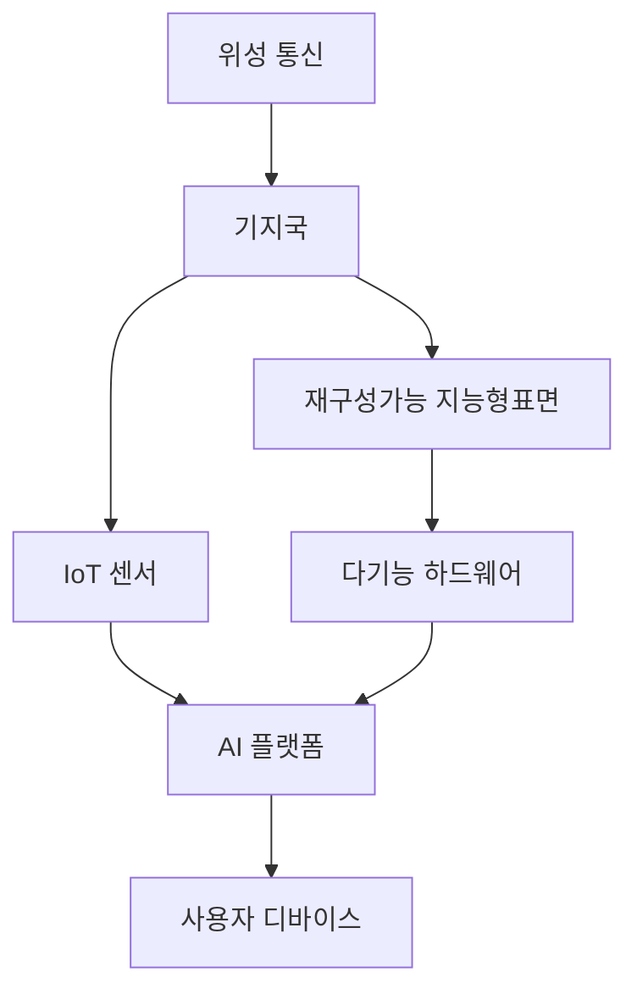

## 6G 무선 포지셔닝 및 센싱 개요

### 6G 무선 포지셔닝 및 센싱 개념

- 6G 무선 통신 시스템은 초고속 데이터 전송, 초저지연, 광범위한 연결성을 제공하며, 포지셔닝 및 센싱 기능을 통해 초정밀 위치 추적 및 환경 데이터 수집을 가능하게함
- 테라비트급 속도, 초정밀 포지셔닝, AI 및 ML 통합

### 6G 무선 포지셔닝 및 센싱 필요성

| 구분 | 필요성 | 내용 |
| --- | --- | --- |
| 정밀도 | 하드웨어 한계 해결 | 고주파 대역에서 높은 정밀도를 위한 ADC, 다중 안테나 배열 등 고성능 설계 필요 |
| 채널 문제 | 복잡한 신호 경로 처리 | 도심 환경의 다중 경로 반사 문제를 해결하기 위한 기술 요구 |
| 다기능성 | 통신과 센싱의 융합 | MIMO, SDR 기술 기반으로 통신과 센싱 기능을 동시 구현하는 다기능 하드웨어 필요 |

## 6G 무선 포지셔닝 및 센싱 구성도, 구성요소, 기술동향

### 6G 무선 포지셔닝 및 센싱 구성도

### 6G 무선 포지셔닝 및 센싱 구성요소

| 구분 | 내용 | 비고 |
| --- | --- | --- |
| 위성 통신 | 저궤도 위성을 활용해 실외 환경에서 높은 커버리지와 안정성 제공 | 5G 대비 10배 이상 커버리지 확대 |
| 지능형 표면 | RIS 활용 신호 반사 및 경로 재구성 | 장애물 극복 및 신호 품질 개선 |
| 다기능 하드웨어 | 통신과 센싱을 통합 수행할 수 있는 하드웨어 설계 |E-MIMO, SDR 등 |
| AI 플랫폼 | 데이터 분석 및 기계 학습을 통해 센싱 및 포지셔닝 최적화 | 신속한 의사결정과 정확도 개선 |

### 6G 무선 포지셔닝 및 센싱 기술동향

| 구분 | 기술동향 | 내용 |
| --- | --- | --- |
| 국내 | 과기정통부 6G 전략 로드맵 | 2030년까지 6G 상용화를 목표로 초정밀 포지셔닝 및 고감도 센싱 기술 개발 진행 |
| | 국제 표준화 작업 | ETRI와 TTA의 ITU 및 3GPP의 국제 표준화 작업 참여 |
| 국외 | 미국 | 연방통신위원회, 국방부의 6G 포지셔닝 및 센싱 기술 연구 지원, 위성 및 드론 기반 기술 연구 |
| | 유럽 | Horizon Europe 프로젝트로 테라헤르츠 기반 고정밀 포지셔닝 기술 개발 |
| | 중국 | 차세대 정보통신 기술 혁신 전략을 통한 대규모 투자 |

## 참조

- [IITP: 주간기술동향 2150호](https://iitp.kr/kr/1/knowledge/periodicalViewA.it?searClassCode=B_ITA_01&masterCode=publication&identifier=1335)
