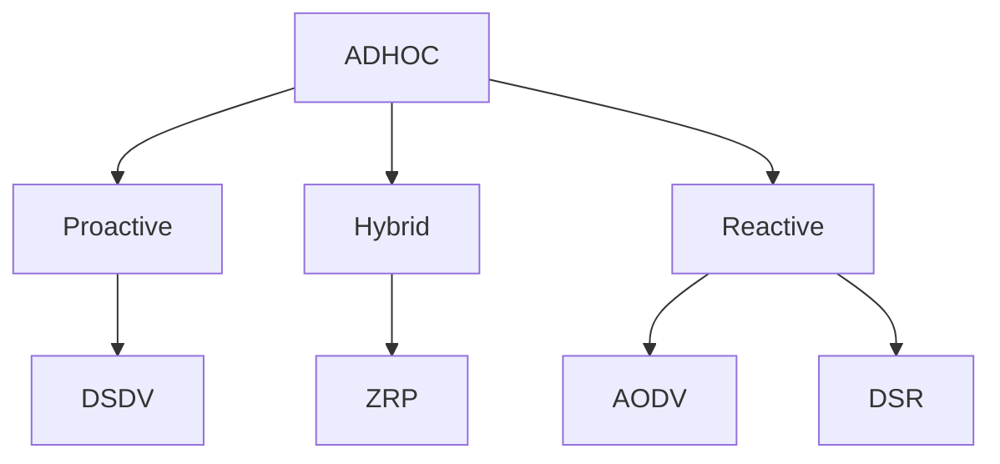
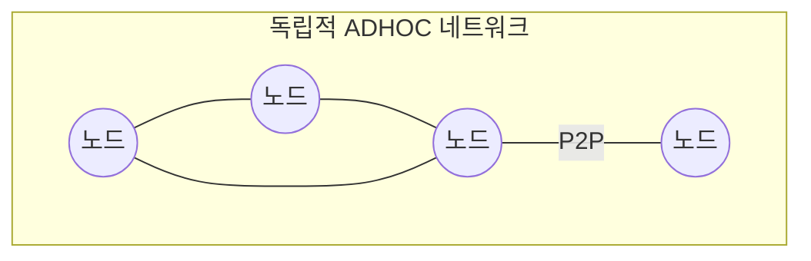
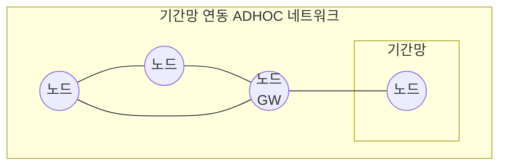
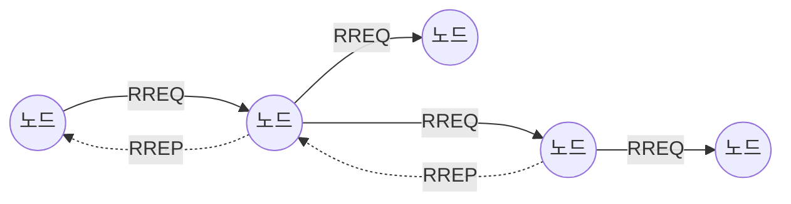

## ADHOC 라우팅 프로토콜의 개념

- 기반시설이 없는 무선 네트워크 환경에서 동적으로 구성되는 라우팅 프로토콜로 각 노드가 라우터 역할을 수행하며 네트워크 토폴로지 변화에 따른 능동적 경로 탐색, 유지 가능
- 저전력, 가입-이탈 자율성, 동적 토폴로지, 이동성, 자가치유, 자가구성

## ADHOC 라우팅 프로토콜 구성도, 핵심요소, 적용방안

### ADHOC 라우팅 프로토콜 구성도

- 기반구조 없이 노드가 호스트, 라우터로 동작하여 동적 경로 형성

- ADHOC 네트워크에 포함된 기기 하나라도 연결시 모든 노드가 기간망 접근 가능

### ADHOC 라우팅 프로토콜 핵심요소

| 구분 | 내용 | 비고 |
| --- | --- | --- |
| 경로탐색 | 네트워크 내에서 최적의 데이터 전송 경로를 동적으로 발견 | Proactive, Reactive |
| 경로유지 | 링크 상태를 모니터링, 경로 이탈시 재구성, 오류 처리 | 고속 이동성 지원 |
| 데이터 전달 | 탐색 경로를 통한 패킷 전송 | 재전송 오류 수정 |

### ADHOC 라우팅 프로토콜 적용방안

| 구분 | 내용 | 비고 |
| --- | --- | --- |
| 공공 | 재난 안전망 | 기존 통신망 마비시 재해복구 지원 |
| - | 전장 운용망 | 군사 작전시 유선망 대체 |
| 민간 | IoT 통신 | 환경 감시 및 실시간 모니터링 |
| - | 스마트 팩토리 | 공장 네트워크 효율화 |

- VANET, FANET 등 차량, UAM 간 ADHOC 통신 구현 가능

## AODV 라우팅 프로토콜

### AODV 라우팅 프로토콜 개념

- 데이터 전송이 발생할 때 경로탐색을 하는 Reactive 방식의 ADHOC 라우팅 프로토콜
- 경로 탐색 오버헤드 감소, 동적 토폴로지 대응, 구현 용이, 에너지 효율

### AODV 라우팅 프로토콜 핵심요소

| 구분 | 내용 | 비고 |
| --- | --- | --- |
| RREQ | 경로 발견을 위해 네트워크 내 브로드캐스팅 | 소스 노드, 주소, 요청 ID 포함 |
| RREP | 경로 발견시 목적지 노드에서 응답 | 라우팅테이블 갱신 |
| RERR | 경로의 장애 발생 알림 | 인접노드 전파 |
| 경로 유지 | 링크 감지 실패시 RERR 메시지를 전송하고 새로운 RREQ 시작 | 네트워크 신뢰성 |
