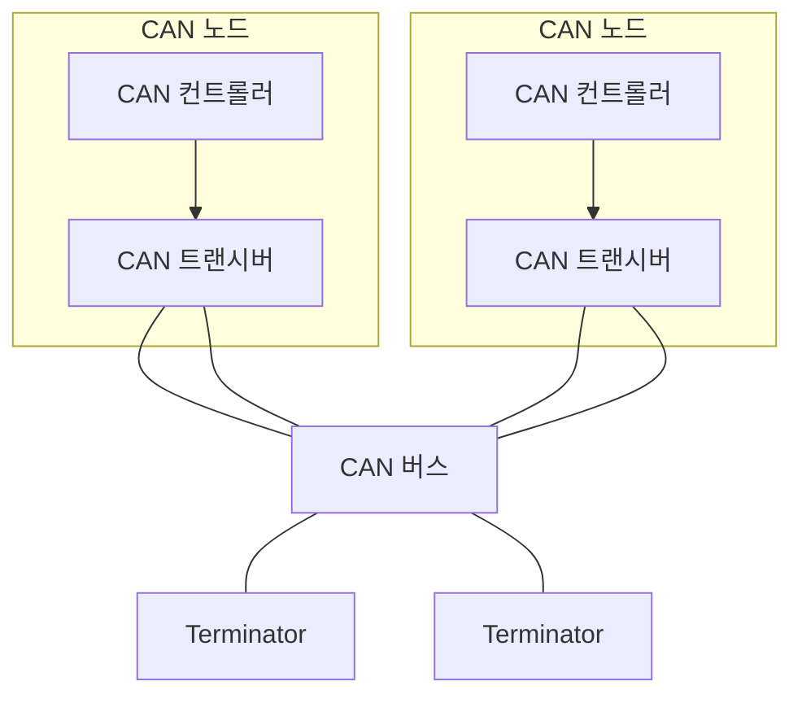

## CAN 개념

- 여러 개의 ==전자제어장치:ECU==가 차량 내에서 서로 통신하기 위해 설계된 ==ISO 11898 표준 직렬 버스시스템==
- 엔진 제어, 변속기 제어, 제동, 안전 시스템 등 장치 간 ==우선순위 기반== 효율적 통신을 위해 필요

## CAN 구성도, 구성요소, 취약점

### CAN 구성도

### CAN 구성요소

| 구분 | 내용 | 비고 |
| --- | --- | --- |
| CAN 노드 | 네트워크에 연결된 장치 | ECU, 센서 등 |
| CAN 컨트롤러 | CAN 프로토콜 처리 핵심 부품 | 노드 내장 |
| CAN 트랜시버 | 컨트롤러와 버스사이 인터페이스 역할 | 변조, 복조 |
| CAN 버스 | 노드를 연결하는 전선 | 2개선 차등 신호 |
| 터미네이터 | 신호 반사와 간섭 방지 | 양 끝단 위치 |

- 멀티마스터, ID 기반 우선순위 프로토콜로 높은 신뢰성 보유

### CAN 취약점, 대응방안

| 구분 | 내용 | 대응방안 |
| --- | --- | --- |
| 전송 데이터 도청 | 암호화되지 않은 데이터 전송 | 암호화 적용 |
| 메세지 위조 | 잘못된 데이터 네트워크 주입 | HMAC 검증 |
| 장애 전파 | 특정 노드 장애가 브로드캐스팅 | 오류 감지, 복구 |
| 부하 공격 | 네트워크상 과다 트래픽 | 비정상 차단 |

## 차량 네트워크 발전 방향

- ADAS 운용을 위해 데이트 프레임, 멀티 컨트롤러 기반의 100Mbps 성능의 EtherLoop 통신으로 전환 예상
