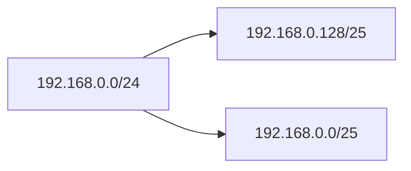
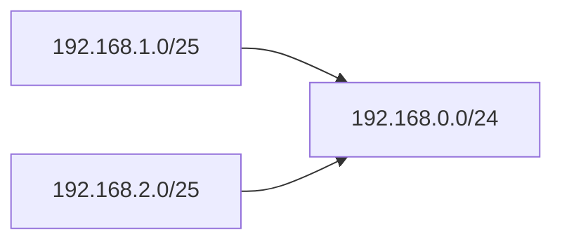

## CIDR 개념

- IP 주소를 효율적으로 할당하고, 인터넷 라우팅 정보를 경제적으로 관리하게 해주는 ==주소할당 및 라우팅 기법==
- IP 주소 고갈문제 해결, 라우팅 테이블 축소, 유연한 네트워크 설계

## 서브네팅, 슈퍼네팅 개념, 특징

### 서브네팅 개념, 특징

| 구분 | 내용 |
| --- | --- |
| 개념 | 하나의 큰 네트워크를 여러 개의 작은 네트워크로 나누는 기법 |
| 특징 | 브로드캐스팅 감소, IP 주소 낭비 최소화 |
| 예시 | 부서별 네트워크 분리, 보안 강화 |

### 슈퍼네팅 개념, 특징

| 구분 | 내용 |
| --- | --- |
| 개념 | 여러 작은 네트워크를 하나의 큰 네트워크로 묶는 기법 |
| 특징 | 라우팅 테이블 크기 감소, 부담 완화, 트래픽 효율성 |
| 예시 | ISP의 IP 주소 할당, BGP 라우팅 |

### 서브넷 마스크 개념, 특징

- IP 주소에서 ==네트워크 주소부와 호스트 주소부를 구분==하는데 사용하는 ==32bit 값==
- ==네트워크 주소부는 1로, 호스트 주소부는 0으로 표시==

> 192.168.0.0/24 에서 4개의 네트워크 구성 예시

| 192 | 168 | 100 | 0 |
| --- | --- | --- | --- |
| 1100 0000 | 1010 1000 | 0110 0100 | **00**00 0000 |

> 네트워크 아이디: 1100 0000 1010 1000 0110 0100
> 호스트 아이디: 0000 0000

| 네트워크 아이디 | 호스트 아이디 | 네트워크 주소 |
| --- | --- | --- |
| 192.168.100. | **00**00 0000 | 192.168.100.0 |
| 192.168.100. | **01**00 0000 | 192.168.100.64 |
| 192.168.100. | **10**00 0000 | 192.168.100.128 |
| 192.168.100. | **11**00 0000 | 192.168.100.192 |

> 서브넷마스크: 255.255.255.192/26
> 사용가능 호스트: $62 = 2^6 - 2$ (네트워크 아이디, 브로드캐스트 주소)
