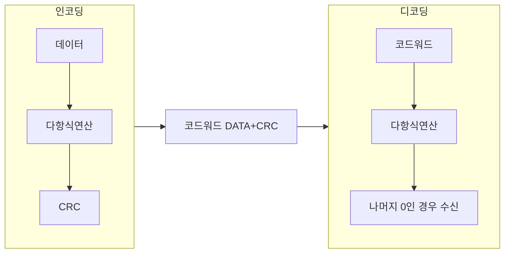

## CRC 개념

- 데이터 전송시 무결성을 확인하기 위해 ==특정한 다항식==으로 ==체크섬==을 구하여 오류를 검출하는 방식
- 데이터 전송 신뢰성 향상, 간단한 계산 속도 및 효율성

## CRC 구성도, 구성요소, 적용방안

### CRC 구성도

### CRC 구성요소

| 구분 | 내용 | 비고 |
|---|---|---|
| 데이터 | 전송하거나 저장하려는 원본 데이터 블록 | 원본 데이터 |
| ==생성 다항식== | 오류 검출을 위한 기준 다항식 | CRC 생성 기준 |
| CRC 계산기 | 데이터 블록에 대해 CRC 값을 계산하는 알고리즘 | 하드웨어 또는 소프트웨어 |
| ==코드워드== | 원본 데이터에 CRC 값을 추가한 최종 데이터 블록 | 전송 또는 저장될 데이터 |

### CRC 적용방안

| 구분 | 내용 | 비고 |
|---|---|---|
| 네트워크 통신 | TCP/IP, Ethernet 등에서 데이터 패킷의 무결성을 확인 | 다양한 통신 프로토콜에 사용 |
| 저장 장치 | 하드 드라이브, SSD, CD/DVD 등에서 데이터 무결성 보장 | 저장된 데이터의 오류 검출 |
| 파일 전송 | FTP에서 데이터 전송 중 발생할 수 있는 오류를 검출 | 파일 전송 프로토콜에 적용 |
| 임베디드 시스템 | 마이크로컨트롤러 등에서 데이터 전송 무결성 확인 | 내장형 시스템의 데이터 통신 신뢰성 보장 |

## CRC 고려사항

- CRC-32 등 표준 다항식 사용으로 안전성, 상호 운용성 확보
