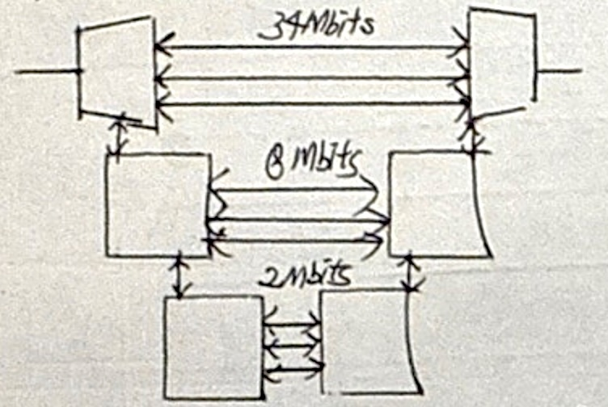
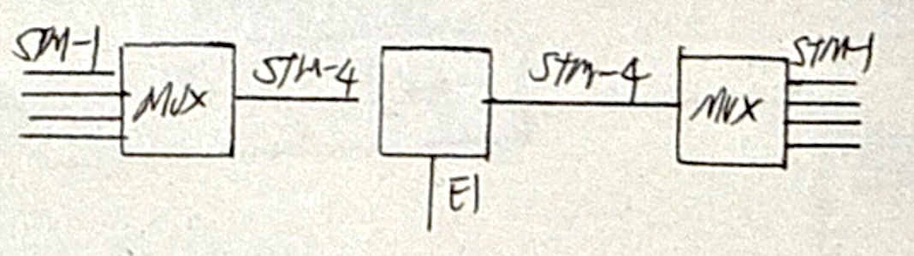
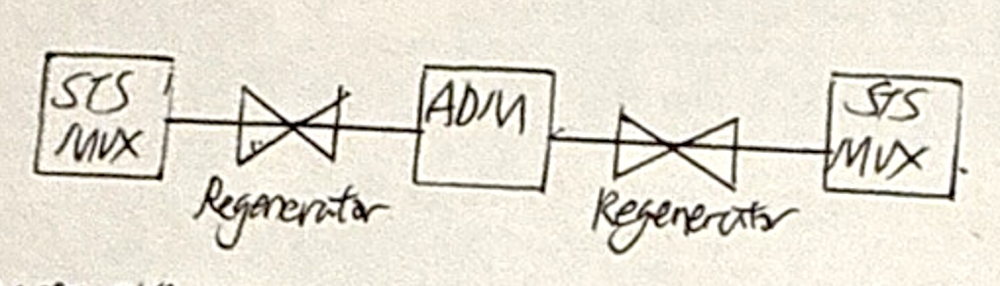
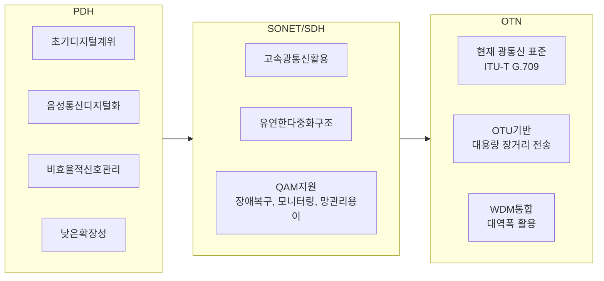

## 디지털 계위 개념 및 유형

### 디지털 계위 개념

- 서로 다른 전송 속도의 디지털 신호를 계층적으로 다루는 전송 구조로, 통신망에서 데이터 전송 효율성과 확장성을 확보하기 위한 체계

### 디지털 계위 유형

| 구분 | 유형 | 특징 |
|---|---|---|
| 비동기 | PDH | 초기 디지털 전송 계위, 비트 인터리빙 |
| 동기 | SDH | ITU-T 표준, 바이트 인터리빙 |
| | SONET | 미국 ANSI 표준, 광통신망 중심 |

## PDH 개념 및 구성요소

### PDH 개념

- 각각의 디지털 다중화 장치들이 자체 발신기 클럭을 사용하여 DS-N 급 신호를 만들어가는 준동기식 다중화 전송 체계

### PDH 구성요소

| 구분 | 기술요소 | 설명 |
| --- | --- | --- |
| 네트워크 | 지역별 이기종 전송 계열 | 북미(T1, T3), 유럽(E1, E3) 등 지역별 상이한 전송 표준으로 상호 호환성 문제 |
| | 비트스터핑 | 준동기 유지 위해 상위 계위 결합시 불필요 비트 삽입, 오버헤드 증가 |
| 계층 | 계층적 다중화 구조 | 하위 신호를 상위 신호로 단계적 다중화, 역다중화 과정 복잡 |

## SDH 개념 및 구성요소

### SDH 개념

- 북미 표준 SONET을 확장한 동기식 디지털 다중화 신호 계위에 관한 ITU-T 국제 표준

### SDH 구성요소

| 구분 | 기술요소 | 설명 |
| --- | --- | --- |
| 네트워크 | Add-Drop Max | 신호의 삽입, 추출을 허용하여 타 전송신호 STM을 경로에 추가/제거하는 장비 |
| | DXC | 전송신호를 교환, 분배하여 유연한 망 구성 지원 |
| | STM-1/4/16 | SDH의 기본 전송단위로 여러 하위 신호를 다중화하여 포함 가능 |
| 계층 | Path | 종단 사이에서 데이터 서비스 전송 |
| | Line | 물리 매체를 통하여 VL-4 등 페이로드 및 오버헤드 전송 |
| | Section | 물리 계층 통해 STM-N 프레임 전송 |
| | Physical | 광섬유 기반 전기신호 전송 |

## SONET 개념 및 구성요소

### SONET 개념

- ANSI에서 제정한 북미표준 광 전송 동기식 디지털 계위

### SONET 구성요소

| 구분 | 기술요소 | 설명 |
| --- | --- | --- |
| 네트워크 | STS-1/3/12 | SONET의 기본전송단위, 완전 동기식 전송 |
| | PTE | 상위 계층 사용자 페이로드를 SONET용으로 처리 |
| | LTE | 망 구성요소 사이에서 PTE 계층 다중화, 동기화, 백업, 스위칭 |
| | STE | 프레임 정렬, 오류 검출, 모니터링 담당 |
| 계층 | 전송 계층 | 경로, 라인, 섹션 계층화, 경로 관리, 흐름 제어 |
| | 물리 계층 | 광섬유 기반 고속 데이터 전송 지원 |

## 디지털 계위 발전 방향

