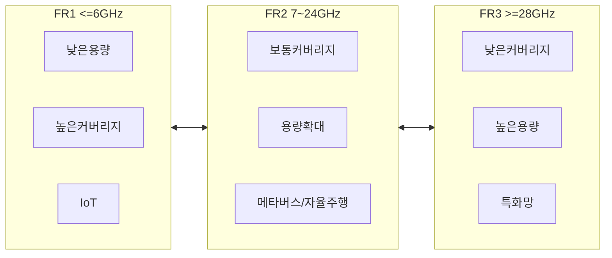

## E-MIMO 개념

- 5G의 mMIMO보다 약 4배 이상 향상된 커버리지와 용량을 목표로 하고, 고주파수의 경로손실문제 해결을 위한 초대규모 다중입출력 기술
- 6G에서 Upper-mid Band(7~24GHz, FR3) 사용을 위해 개발, 초고속 통신, 적은 지연시간, 높은 데이터 속도

## E-MIMO 개념도, 기술요소, 개발동향

### E-MIMO 개념도

### E-MIMO 기술요소

| 구분 | 기술요소 | 내용 |
| --- | --- | --- |
| 빔포밍 | 디지털/하이브리드 빔포밍 | 대역폭 활용과 효율적 에너지 소비를 지원 |
| RF 기술 | GaN, GaAs 반도체 기술 | FR3 대역에 적합한 고출력, 고효율 RF 트랜시버 |
| 안테나 설계 | 대규모 어레이 및 모듈화 기술 | 효율적 공간 사용과 방사 손실 최소화 |
| 에너지 효율 | 저복잡도와 저전력 구현 기술 | 탄소절감 에너지 사용의 효율화 달성 |
| 통신-센싱 융합 | 환경 센싱 후 이동성 및 빔 형성에 활용 | 센싱 기반 커버리지 향상 및 새로운 서비스 제공 가능 |

### E-MIMO 개발동향

| 구분 |동향 |내용 |
| --- | --- | --- |
| 국내 |삼성전자 X-MIMO | FR3 대역의 전파 손실 해결 및 안테나 밀도 향상 연구 |
| | 중소기업 및 연구기관 | 선진 기술에 필적하는 E-MIMO 연구 및 프로토타입 개발 |
| 국외 | 퀄컴 GIGA MIMO | 4096개 안테나와 256 디지털 체인을 기반으로 높은 용량 제공 |
| | 화웨이 | 에너지 절감을 위한 PowerStar 솔루션 연구 및 6G 확장 |
| | 에릭슨 | 유럽 프로젝트와 협력하여 친환경 기지국과 반도체 기술 발전 연구 |
| | 노키아 | FR1 기지국 재사용을 통한 FR3 비용 감소 및 6G 준비 |

## 참조

- [IITP 주간기술동향 2146호](https://iitp.kr/kr/1/knowledge/periodicalViewA.it?searClassCode=B_ITA_01&masterCode=publication&identifier=1331)
