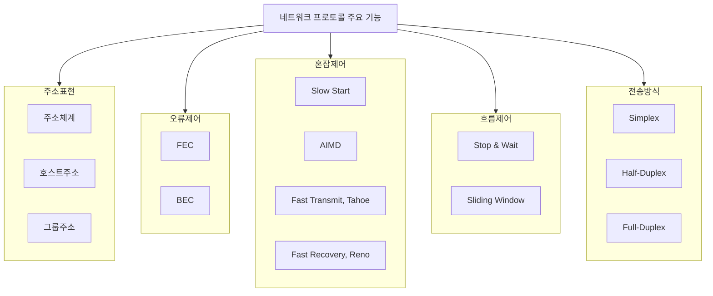

## 네트워크 프로토콜 설계 개념

- 네트워크 프로토콜 설계시 주소표현과 데이터 전달방식을 결정하고 신뢰성을 위해 오류제어와 흐름제어 기능 추가

## 오류제어 개념 및 기법

### 오류제어 개념

- 부가정보를 추가하여 데이터 전송 중 발생하는 오류를 검출하여 재전송요구(BEC)하거나, 수신 측에서 직접 수정(FEC)하는 매커니즘
- 데이터 무결성, 신뢰성

### 오류제어 기법

| 구분 | 기법 | 내용 |
| --- | --- | --- |
| 오류 검출 | 패리티 검사 | 짝수, 홀수 패티리 추가로 오류 검출 |
| | 체크섬 | 데이터 블록 합을 계산해서 오류 검출 |
| | CRC | 데이터 블록을 다항식으로 나눈 나머지 추가 |
| FEC | 블록부호 | 일정 크기 데이터 블록에 중복 비트 추가 |
| | 길쌈부호 | 연속적 데이터 흐름에 중복 비트 추가 |
| BEC | ARQ | 오류 발생시 송신 측에 재요청 |
| | Hybrid ARQ | FEC + ARQ, 일부 오류 수정 후 불가시 재요청 |

## 흐름제어 개념 및 기법

### 흐름제어 개념

- 송신자, 수신자 간 데이터 전송속도를 조절하여 수신자가 처리 가능한 범위를 넘은 전송을 방지하는 기법
- 데이터 손실 최소화, 수신 버퍼 오버플로우 방지, 혼잡 완화

### 흐름제어 기법

| 구분 | 내용 | 비고 |
| --- | --- | --- |
| Stop & Wait | 송신측은 데이터 패킷을 하나씩 전송, 수신측의 ACK 응답 대기 | 낮은 효율, 같은 구현 |
| Sliding Window | 여러 개의 패킷 연속 전송, 수신측의 ACK 수신 확인 후 윈도우 조절 | 효율적, 범용적 |
| Rate-based Flow Control | 송신측은 수신측의 피드백 정보를 기반으로 데이터 전송속도 조절 | 혼잡제어 같이 사용 |

## 혼잡제어 개념 및 매커니즘

### 혼잡제어 개념

- 데이터 전송 중에 네트워크 혼잡을 방지하고 효율적으로 데이터 패킷을 전달하기 위한 메커니즘

### 혼잡제어 매커니즘

| 구분 | 내용 | 비고 |
| --- | --- | --- |
| 1. Slow Start  | 새로운 연결 또는 타임아웃 후 시작 혼잡 윈도우를 작게 시작해 지수적으로 증가 | 초기 네트워크 상태 탐색 |
| 2. Congestion avoidance | 네트워크 혼잡을 예방하는 단계 AIMD 알고리즘 사용 혼잡 윈도우 크기를 조절 | 혼잡시 Threshold 감소 |
| 3. Fast Recovery | 패킷 손실 시 혼잡 윈도우를 반으로 줄이고 전송 지속 | 손실 후에도 데이터 전송 계속 |
| 4. Fast Transmit | 중복된 ACK 3개 이상 수신 시 손실된 패킷 즉시 재전송 타임아웃 없이 손실 처리 | 전송 효율 증가 |

## 데이터 전송방식 개념 및 기법

### 데이터 전송방식 개념

- 데이터가 송수신측 사이에서 어떻게 전달할지를 구현하는 방법

### 데이터 전송 기법

| 구분 | 내용 | 비고 |
| --- | --- | --- |
| Simplex | 단방향 아이디 전송 | TV, 라디오 |
| Half-Duplex | 양방향 전송이나 한 순간에는 한 방향만 가능 | 무전기 |
| Full-Duplex | 동시에 양방향 전송 가능 | 전화, 화상통화 |
