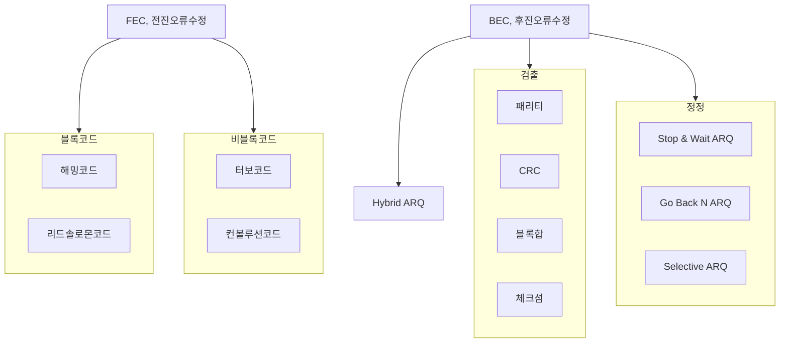
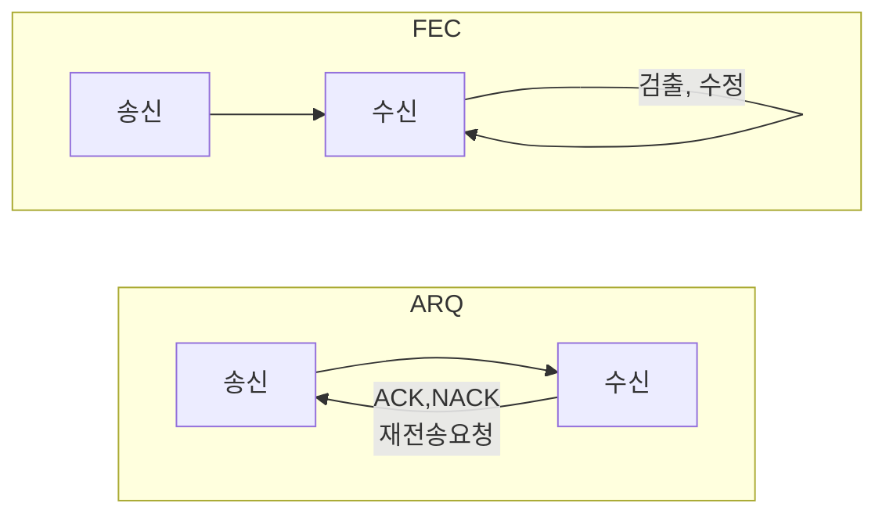

## 오류제어 방식의 개념

## FEC, ARQ 개념, 핵심요소 비교

### FEC, ARQ 개념

- FEC는 검증 단말에 오버헤드, ARQ는 재전송으로 인한 네트워크 오베헤드 발생

### FEC, ARQ 핵심요소 비교

| 구분 | FEC | ARQ |
| --- | --- | --- |
| 특징 | 실시간, 높은 처리율 | 재전송요구로 복잡한 알고리즘 불필요 |
| 용도 | 1:N 통신환경 | 실시간 처리 불필요 |
| | 채널 열악, 무선환경 | 단말 성능 열악 |
| | 재전송 시도불가 환경 | 전이중 통신 환경 |
| 장점 | 연속적 데이터 전송으로 높은 효율, 전송 지연 없음 | 알고리즘 간단, 단순한 단말구성, 채널적응력 우수 |
| 단점 | 복잡한 검출 알고리즘, 검출 및 정정 하드웨어 성능 필요 | 송수신 버퍼 필요, 채널 불안정시 재전송 요구 폭증 |

## ARQ 유형

| 구분 | 내용 | 비고 |
| --- | --- | --- |
| Stop & Wait ARQ | 한 번에 하나의 프레임 전송 후 ACK를 받을 때까지 대기 | 단순, 낮은 전송 효율 |
| Go Back N ARQ | 여러 프래임 연속 전송, 오류 발생 프레임 이후 모든 프레임 재전송 | 전송효율 상대적 높음 |
| Selective Repeat ARQ | 여러 프레임 연속 전송, 오류 발생 특정 프레임만 재전송 | 전송효율 우수, 구현 복잡 |
| Adaptive ARQ | 전송환경에 따라 전송 속도나 재전송 전략을 동적 조절 | 패킷 오류율, SNR, 전송 지연 |
| Hybrid ARQ | FEC로 정정시도 후 실패시 ARQ 시도 | 무선, 위선통신, 높은 신뢰성 |

## 오류제어 방식 선택시 고려사항

- 채널 환경, 데이터 중요도, 실시간 요구사항을 고려하여 적합한 제어 방식 선택
