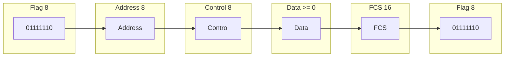
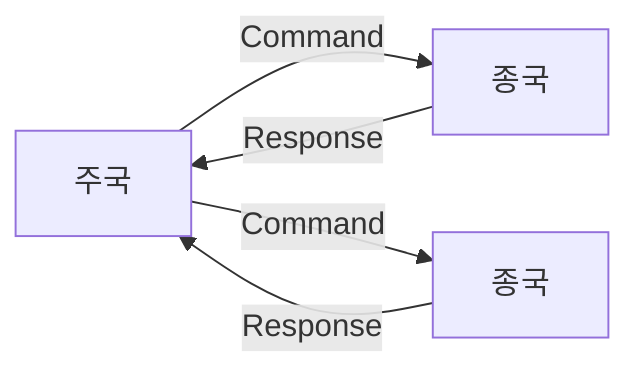

## HDLC 프로토콜 개념

- 일대일, 일대다 연결 환경에서 비트프레임 구조의 데이터를 송수신하는 데이터링크 계층 ISO13239 표준 프로토콜
- 비트지향 프로토콜, 동기식 전송, 다양한 토폴로지 지원, 오류제어, 흐름제어, 모드 지원

## HDLC 프레임 구조, 동작 모드

### HDLC 프레임 구조

| 필드 | 길이 | 설명 |
| --- | --- | --- |
| Flag | 8 | 프레임 시작, 종료 표시, 011111102 |
| Address | 8 | 일대다 주국, 종국 주소, 일대일 명령, 응답 구분 |
| Control | 8 | 프레임 종류, 제어 정보, 송수신 순서번호 |
| Data | 가변 | L3 계층이 송신한 패킷 데이터 |
| FCS | 16 | 오류제어, CRC-16 기반 오류 검출 코드 |

### HDLC 프레임 동작 모드

#### NRM (Normal Response Mode)

> 정규응답모드

- 주국/종국 구분 동작
- 종국은 주국의 폴링 요청에만 응답
- 종국은 프레임 전송 후 다시 허가 대기

#### ARM (Asynchronous Response Mode)

> 비동기응답모드

- 종국은 주국 승인 없이 비동기적 응답 가능
- 종국의 모든 전송은 주국으로 전송되어 최종 목적지로 중계
- 실제로 거의 사용되지 않음

#### ABM (Asynchronous Balanced Mode)

> 비동기균형모드

- 복합국은 동등한 권한을 가짐
- 양쪽에서 명령/응답 전송 가능
- 폴링 오버헤드가 없어 P2P 환경에서 가장 많이 사용

## HDLC, 이더넷 비교

| 구분 | HDLC | 이더넷 |
| --- | --- | --- |
| 네트워크 환경 | WAN 환경 | LAN 환경 |
| 데이터 구조 | 비트 중심 | 프레임 중심 |
| 송수신 형식 | 동기식, 비동기 모드 지원 | 비동기식 |
| 표준 | ISO 13239 | IEEE 802.3 |
| 주소체계 | Address 필드 | MAC 주소 |
