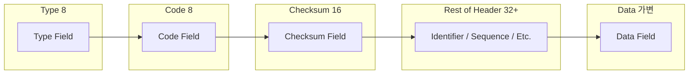
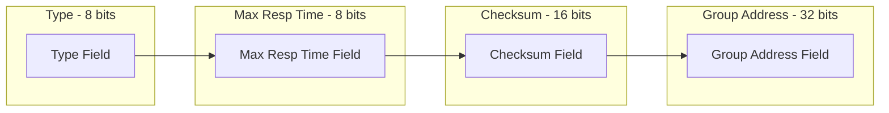
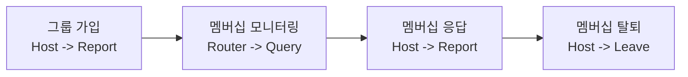

## ICMP 개념, 구성도

### ICMP 개념

- IP 패킷을 전송하는 과정에서 발생하는 오류 및 제어 메시지를 처리하기 위한 프로토콜
- Ping(Echo Request/Reply), Destination Unreachable 등 네트워크 진단 및 관리에 사용

### ICMP 패킷 구성도

| 구분 | 크기 | 설명 |
| --- | --- | --- |
| Type | 8 | ICMP 메시지 유형 0=Echo Reply, 8=Echo Request, 3=Dest. Unreachable 등 |
| Code | 8 | Type에 따른 세부 코드 |
| Checksum | 16 | ICMP 헤더+데이터를 합한 오류 검출을 위한 체크섬 |
| Rest of Header | 32 이상 | Type, Code 조합에 따라 식별자, 시퀀스 등 추가 정보 |
| Data | 가변 | ICMP 메시지의 실제 데이터 |

## IGMP 개념, 구성도

### IGMP 개념

- 호스트와 라우터가 멀티캐스트 그룹에 대한 가입(Join)과 탈퇴(Leave) 등을 관리하기 위한 프로토콜
- 멀티캐스트 통신을 효율적으로 지원하기 위해 사용

### IGMP 패킷 구성도

| 구분 | 크기 | 설명 |
| --- | --- | --- |
| Type | 8 | IGMP 메시지 유형 0x11=Membership Query, 0x16=Membership Report v2, 0x17=Leave Group 등 |
| Max Resp Time | 8 | Membership Query에 대한 최대 응답 시간 |
| Checksum | 16 | IGMP 헤더 전체에 대한 오류 검출을 위한 체크섬 |
| Group Address | 32 | 멀티캐스트 그룹 주소 General Query 시 0.0.0.0, 특정 그룹 쿼리 시 해당 멀티캐스트 주소 |

- IGMP V3에서는 소스별 멀티캐스트 트래픽 관리 기능이 추가되어 Number of Sources와 Source Address 필드가 추가됨

## IGMP 가입 절차도, 세부 절차

### IGMP 가입 절차도

### IGMP 가입 세부 절차

| 단계 | 설명 | 비고 |
| --- | --- | --- |
| 1. 그룹 가입 | 호스트가 새 멀티캐스트 그룹에 참여하고자 할 때 라우터에 가입 알림 전송 | Membership Report |
| 2. 멤버십 모니터링 | 라우터는 주기적으로 Query 메시지를 전송, 현재 그룹을 계속 사용하는 호스트가 있는지 확인 | Membership Query |
| 3. 멤버십 응답 | 호스트는 Query에 응답하여 아직 그룹이 필요함을 알림, 무응답 시 라우터는 더 이상 호스트가 없음 판단 | Membership Report |
| 4. 멤버십 탈퇴 | 호스트가 멀티캐스트 수신을 중단하고 싶으면 Leave Group 메시지 전송 | Leave Group |

## ICMP, IGMP 비교

| 구분 | ICMP | IGMP |
| --- | --- | --- |
| 목적 | IP 패킷 전송 오류 및 제어 메시지 처리 | 멀티캐스트 그룹 가입/탈퇴 관리 |
| 유형 | Echo Request/Reply, Dest. Unreachable 등 | Membership Query, Membership Report, Leave Group 등 |
| 계층 | 네트워크 계층 | 네트워크 계층 |
| 사례 | Ping, Traceroute | IPTV, 온라인 게임 등 멀티캐스트 서비스 |
| 데이터전송 | 오류, 제어 메세지 전송 데이터 페이로드는 네트워크 진단용 | 그룹 멤버십 정보 전송 실제 멀티캐스트 데이터는 UDP, RTP 상위 프로토콜 사용 |
| 보안 취약점 | Ping Flooding, DDoS 등 | IGMP Spoofing, IGMP Flooding 등 |
| 특징 | 일부 환경에서 ICMP 차단하여 진단 제약 발생 가능 | 그룹별, 소스별 트래픽 구분하여 필요 트래픽 전달 가능 |
