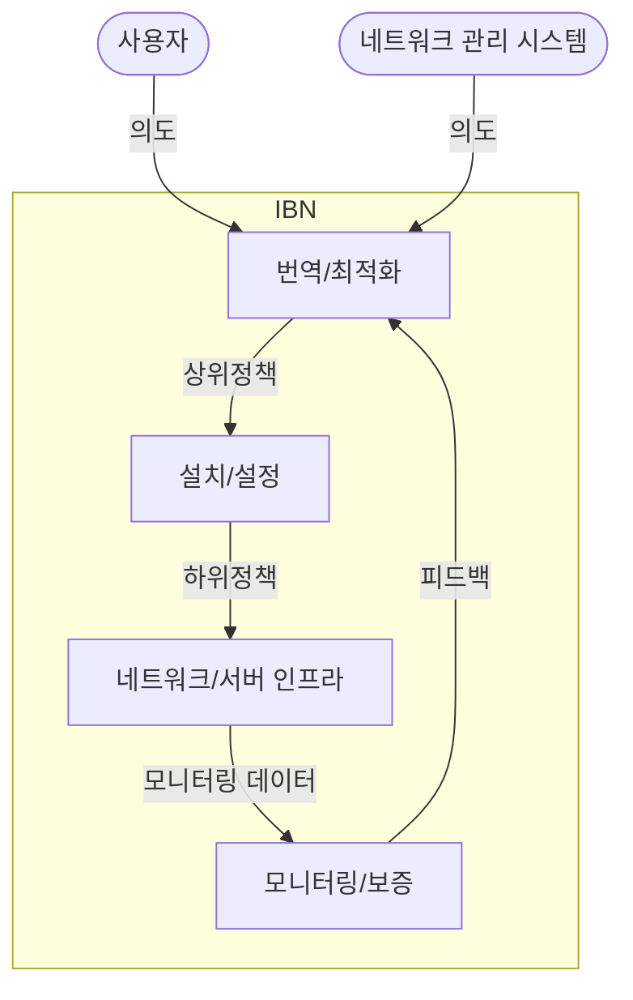

## 의도 기반 네트워킹 개요

### 의도 기반 네트워킹 개념

- 네트워크 관리자의 의도를 인공지능 기술로 파악하여 인터넷을 구성하는 유무선망 설정을 자동으로 수행하는 기술
- 선언적 명령을 통해 네트워크 구성과 관리 단순화, 인공지능(AI), 자연어 처리(NLP)와의 통합을 통해 자동화 수준 제고

### 의도 기반 네트워킹 필요성

| 구분 | 필요성 | 내용 |
| --- | --- | --- |
| 관리 복잡성 | 네트워크 증가 및 복잡성 완화 | 기존 네트워크는 수동 구성으로 인해 시간 소모 및 오류 가능성 존재 |
| 자동화 | AI/ML 기반 최적화 | 인공지능 및 기계 학습 기반으로 실시간 네트워크 최적화와 적응형 관리 가능 |
| 표준화 | 환경 적합성 | 다중 연결 장치와 네트워크의 효율적 관리를 위해 표준화된 접근 방식 요구 |

## 의도 기반 네트워킹 개념도, 핵심요소, 기술동향

### 의도 기반 네트워킹 개념도

- 각각의 단계에서 LLM, ML, 딥러닝 및 최적화 기술 적용

### 의도 기반 네트워킹 핵심요소

| 구분 | 핵심요소 | 내용 |
| --- | --- | --- |
| 정책 처리 | ==의도 인식== | 사용자 텍스트/음성 입력을 통해 네트워크 의도를 정의 및 생성 |
| | ==의도 번역== | 사용자나 관리자의 의도를 상위 정책으로 변환 |
| | 정책 최적화 | 번역된 정책을 컴퓨터가 실행 가능한 명령어로 최적화하여 네트워크에 적용 가능하게 처리 |
| 정책 실행 | ==의도 적용== | 최적화된 정책을 네트워크 장비나 가상화 인프라(VNF, CNF)에 배치 |
| 운영 관리 | ==의도 모니터링== | 네트워크 상태를 지속적으로 관찰하여 의도대로 작동하는지 확인 및 데이터 분석 |
| | ==의도 검증== | 의도와 네트워크 성능이 일치하는지 검증하며, 부족한 성능 최적화 요청 |
| | ==의도 재설정== | 필요 시 정책을 재작성하거나 재설정하여 네트워크 최적화 수행 |

- 실시간 의도 재설정에서 발생하는 레이턴시를 줄이기 위해 SDN, 엣지 컴퓨팅 활용

### 의도 기반 네트워킹 기술동향

| 구분 | 기술동향 | 내용 |
| --- | --- | --- |
| 국내 | 3GPP 표준화 작업 | IBN 관련 의도 번역 및 실행 모듈 개발, NFV/SDN 표준화 참여 |
| | 5G 기반 IBN 테스트베드 | 국내 기업들이 AI 기반 네트워크 관리 시스템 구축 실증 |
| 국외 | Cisco | AI 기반 네트워크 번역 및 모니터링 기술로 시장 선도 |
| | 화웨이 | 캠퍼스 네트워크 자동화와 오픈 소스 플랫폼 개발 |

- IBN 시장규모는 연평균 25% 성장할 것으로 예측, 기술 개발 및 표준화에 지속적 관심과 투자 필요
