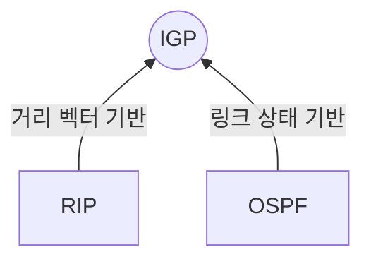

## 내부 게이트웨이 프로토콜

- 네트워크 규모에 따라 소규모 네트워크에서 주기적으로 라우팅 정보를 교환하는 RIP, 대규모 네트워크에서 Dijkstra 알고리즘을 사용하여 최단 경로를 계산한 OSPF 선택

## RIP, OSPF 동작 매커니즘, 상세 비교, 활용 방안

### RIP, OSPF 동작 매커니즘

### RIP, OSPF 상세 비교

| 구분 | RIP | OSPF |
| --- | --- | --- |
| 프로토콜 유형 | 내부 게이트웨이 프로토콜 | 내부 게이트웨이 프로토콜 |
| 알고리즘 | 거리 벡터 알고리즘 | 링크 상태 알고리즘 |
| 최대 홉 수 | 15 | 제한 없음 |
| 전송 계층 프로토콜 | UDP | IP |
| 특징 | 주기적 업데이트, 단순 구조 | 빠른 수렴, 멀티캐스트 사용 |

### RIP, OSPF 활용 방안

| 구분 | 내용 | 적용 방안 |
| --- | --- | --- |
| RIP | 소규모 네트워크에서 기본 라우팅 제공 | 구현 및 유지보수 용이 |
| | 최대 홉 수 제한으로 인해 대규모 네트워크에는 부적합 | OSPF 등 다른 IGP 프로토콜 검토 |
| OSPF | 대규모 네트워크에서 확장성과 안정성 요구 | 빠른 수렴, 정확한 경로 선택 |
| | 복잡한 설정 및 높은 리소스 요구 | 전문가 컨설팅 및 하드웨어 성능 확보 |
