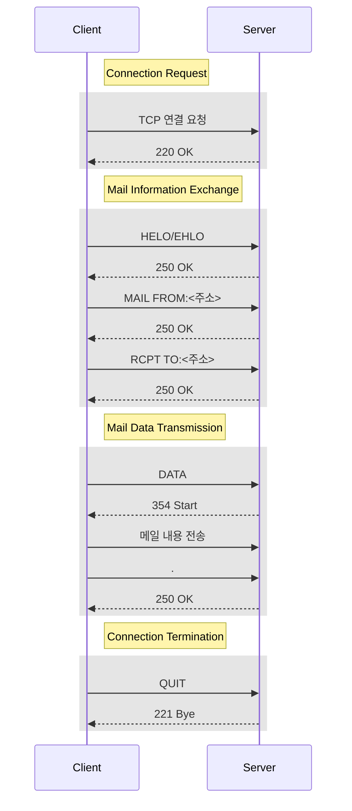

## 전자메일 전송 과정 개요

- 메일 클라이언트로 메일 전송시 SMTP 서버의 IP주소와 포트로 서버 연결, 네트워크 IP주소에 해당하는 MAC주소를 찾아 패킷을 전송하고, 수신자의 전자메일 주소로 최종 배달

## IP, MAC, Port, 전자메일 주소 설명

| 계층 | 구분 | 내용 |
| --- | --- | --- |
| L7 | 전자메일 주소 | 전자메일을 받는 개인, 조직을 식별하기 위한 주소 |
| L4 | 포트 | IP 위에서 어플리케이션 상호 구분을 위해 사용하는 번호 |
| L3 | IP | 호스트, 라우터 간 패킷 전달을 위해 사용하는 주소체계 |
| L2 | MAC | 물리적으로 연결된 노드 간 프레임 전송을 위한 주소체계 |

## SMTP 메일 전송 과정

| 단계 | 내용 | 비고 |
| --- | --- | --- |
| 연결 설정 | 서버의 SMTP 포트로 TCP 연결 | 연결 수락 |
| 메일 정보 전송 | HELO/EHLO 명령으로 인사 후 메일 주소 교환 | 각 명령에 OK 수신 |
| 메일 데이터 전송 | DATA 전송 후 헤더, 본문 전송, `.` 전송 후 본문 마침 | 354 Start, 250 OK |
| 연결 종료 | QUIT 명령 수신 후 연결 종료 | 221 Bye |
