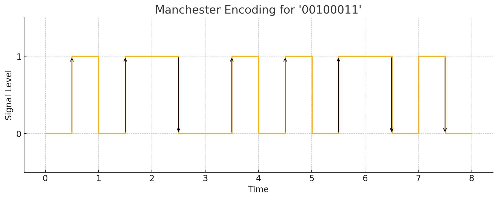
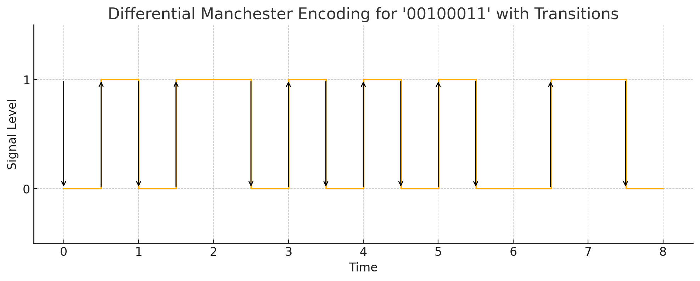

## 맨체스터 코딩 개념

- 각 비트의 중간 시점에 전압 레벨을 반전시켜, 동기화와 오류검출에 이점을 가진 라인코딩 방식
- 클록 동기화 용이, 오류 검출 유리, DC(직류성분) 감소, NRZ 대비 대역폭 2배 필요

## 맨체스터 코딩 구조도, 동작 원리

### 맨체스터 코딩 구조도

- 비트 중간에서 하향 전이하면 0, 상향 전이하면 1로 부호화

### 맨체스터 코딩 동작원리

| 순서 | 절차 | 설명 |
| --- | --- | --- |
| 1 | 인코더에 데이터 입력 | 이진 데이터 입력, 비트별 부호화 수행 |
| 2 | 비트상태 변환 및 전송 | 0 비트 하향 전이, 1 비트 상향 전이 후 전송 |
| 3 | 데이터 신호 해석 | 비트 중간 반전 시점 해석, 데이터 추출 |
| 4 | 이진 데이터 비트 출력 | 추출 데이터를 비트로 출력하여 원 데이터 수신 |

## 차등 맨체스터 코딩 구조도

- 0: 시작점에서 전이, 1: 시작점에서 전이 없음, 모든 비트 중간점에서 항상 전이

## 맨체스터 코딩, 차등 멘체스터 코딩 비교

| 구분 | 맨체스터 코딩 | 차등 맨체스터 코딩 |
| --- | --- | --- |
| 개념 | 비트 중간 신호를 상하향 전이, 시간 정보와 데이터 전달 역할 수행 | 인접 신호의 변화를 표현하기 위한 차등 인코딩과 맨체스터 코딩 결합 |
| 신호표현 | 0: +전압에서 -로 하향 전이 1: -전압에서 +로 상향 전이 | 0: 비트 시작 전이 없음 비트 중간 전이 발생, 1: 비트 시작, 중간 모두 전이 |
| 장점 | 설계, 구현 단순 에지 검출로 클록 동기화 용이 | 빠른 전송 속도 극성 반전 없음, 노이즈 강건성 |
| 단점 | 낮은 대역폭 효율성 | 높은 구현 복잡도, 초기 상태 의존성 |
| 활용 분야 | 초기 이더넷, RFID | Token Ring LAN, 극성 완전 네트워크 |
