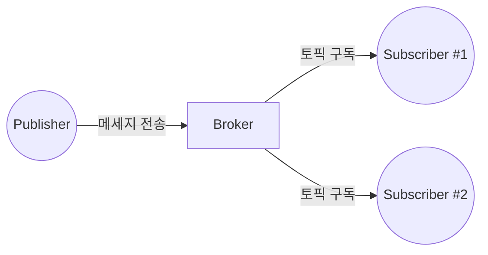

## MQTT 개념

- 클라이언트와 서버간 비동기 메세지 전달을 위한 경량 Pub/Sub 구조 TCP 프로토콜
- 저전력, 대역폭 제한 환경, 메세징, IoT, 낮은 지연, 실시간, 다양한 OS, 언어 지원

## MQTT 구성도, 구성요소, 적용방안

### MQTT 구성도

### MQTT 구성요소

| 구분 | 내용 | 비고 |
| --- | --- | --- |
| Publisher | 메세지를 특정 토픽에 발행하는 클라이언트 | 센서, 모바일기기 등 |
| Subscriber | 특정 토픽의 메세지를 구독하는 클라이언트 또는 서버 | 모니터링 시스템, 제어장치 등 |
| Broker | 발행된 메세지를 해당 토픽을 구독하는 클라이언트에 중개 | 메세지 라우팅 |
| Topic | 메세지를 분류하기 위한 계층적 문자열 | home/room/humid 등 |

### MQTT 적용방안

| 구분 | 내용 | 비고 |
| --- | --- | --- |
| 스마트홈 | 다양한 센서, 장치 간 데이터 전송, 상태 업데이트 | 편의성, 에너지 절약 |
| 산업 자동화 | 로봇과 센서간 실시간 데이터 처리 | 생산성, 안정성 |
| 헬스케어 | 환자 상태 모니터링, 의료기기 제어 | 응급상황 대처 |
| 스마트시티 | 교통정보, 환경정보, 공공시설 관리 | 효율성, 편의성 |

## MQTT 고려사항

- 장치 간 직접통신이 필요하거나 다양한 유,무선 프로토콜을 커버해야할 경우 Matter 사용 고려
