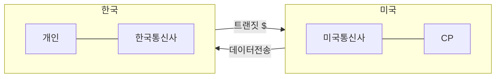

## 망 중립성 개념

- 인터넷 통신 사업자가 인터넷에 접속하는 모든 사업자나 사용자의 접속과 트래픽을 ==차별없이 동등하게 취급==해야한다는 원칙
- 영상 트래픽의 폭증, 망 제공사업자의 수익성, 망 제어기술의 발전으로 인해 논의 본격화

## 망 중립성 이슈 개념도, 주장, 대응방안

### 망 중립성 이슈 개념도

- 넷플릭스, 유튜브 등 해외 CP 데이터 수신시, ISP 티어 차이로 인해 트랜짓 비용 발생

### 망 중립성 이슈 주장

| 구분 | 찬성 | 반대 |
| --- | --- | --- |
| 대상 | 컨텐츠 제공자 | 망 사업자 |
| 주장 | 사용자 이익을 위해 망 사업자의 중립적 트래픽 처리 필요 | 효율적인 망 운영과 투자 저해요인 제거 |
| 통신망 관점 | 공공인프라 자산 | 적절한 투자, 유지보수로 운영, 구축 가능 |

### 망 중립성 대응 방안

| 구분 | 내용 | 비고 |
| --- | --- | --- |
| 정책 | ISP 간 피어링 비용 감소 | 망 중립 부담 완화 |
| ISP | 해저 케이블 등 시설 투자 | ISP 티어1 전환 |
| CP | 캐시서버 구축 | 티어 간 트래픽 비용 분담 |

## 망 중립성 이슈 발전 제언

- 높은 망 사용 비용으로 해외 주요서비스가 철수하여 사용자의 서비스 선택권 저해
- 발신자 종량제 폐지로 피어링 비용 부담 완화 필요
