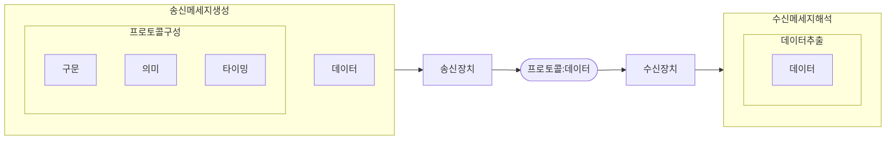
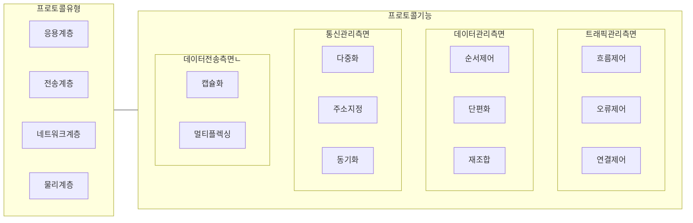

## 네트워크 프로토콜 개념

- 네트워크 상에서 데이터 전송 규칙과 절차를 정의하여 효율적이고 신뢰서 있는 통신을 보장하는 규약

## 네트워크 프로토콜 구성도, 3가지 요소

### 프로토콜 구성도

- 프로토콜을 정의한 RFC 문서에 따라 구문, 의미, 타이밍 등을 기반으로 송수신 장치간 네트워크 통신 수행

### 프로토콜 3가지 요소 상세

| 구분 | 상세요소 | 설명 |
| --- | --- | --- |
| 구문 | 포맷 | 통신, 처리, 해석에 적합하도록 형식, 규격화된 표현 |
| - | 부호화 | Row data와 부호 간의 대응 관계, 압축, 암호화 수행 |
| - | 신호레벨 | 물리적인 신호 크기, 감도, 주파수 크기 |
| 의미 | 정보규격정의 | 특정 패턴을 어떻게 해석하고 동작할지 결정 |
| - | 오류제어 | 으미 기반 통신 메세지 오류 제어 |
| - | 동기제어 | 송수신 장치 간 상태 일치 및 제어 |
| 타이밍 | 속도 | 통신 속도, 단위, Band Rate 등 |
| - | 순서제어 | 송수신 장치 간 메세지 순서 규정 및 제어 |

## 프로토콜 유형 및 기능

- ISO7498 표준에 따른 응용계층, 전송계층, 네트워크계층, 물리계층 프로토콜로 구분
