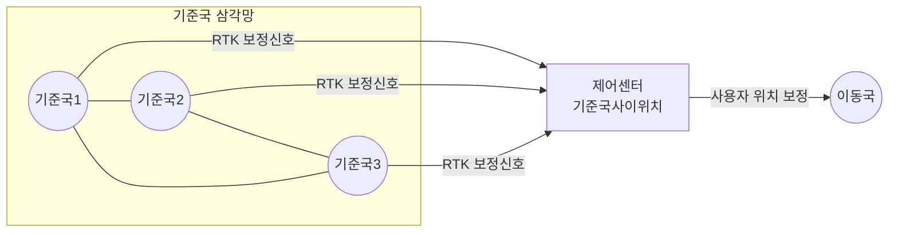

## NRTK 개념

- GNSS를 기반으로 다수의 기준국 네트워크를 이용하여 오차를 실시간으로 보정하고 이동국의 위치를 세티미터 단위로 정밀하게 측정하는 기술
- 기존 RTK 범위, 오차로 인한 한계 극복, 위치 정밀보정 요구 증가, 통신 기술 발전

## NRTK 구성도, 구성요소, 보정신호 구분

### NRTK 구성도

### NRTK 구성요소

| 구분 | 설명 | 비고 |
| --- | --- | --- |
| 기준국 | 다수 GNSS 기지국이 위성신호를 수신하여 오차데이터를 제어센터로 전송 | 광역오차 데이터 수집 |
| 제어센터 | 기준국 데이터 옹합, 오차모델 생성, 가상 기준점 생성 | 실시간 보정 데이터 전송 |
| 이동국 | GNSS 신호와 보정데이터를 결합하여 정밀한 위치 계산 | cm 단위 오차 보정 |

### NRTK 보정신호 구분

| 방식 | 설명 | 특징 |
| --- | --- | --- |
| VRS | 사용자 위치에 가상기준국을 생성하여 보정신호 제공 | 양방향 통신 필요 |
| FKP | 기준국 관측망 전체에 적용 가능한 보정신호 제공 | 삼각망 내 모든 지점 적용 가능 |
| MAC | 주기준국과 보조기준국 간 차이를 계산하여 셀 단위 보정 신호 제공 | 셀 내 모든 지점에 대한 보정 정보 제공 |
| SSR | 상태공간 표현을 통해 위성 및 대기 상태 정보를 분리하여 제공 | 위성 궤도, 전리층, 대류층 상태 포함 |
