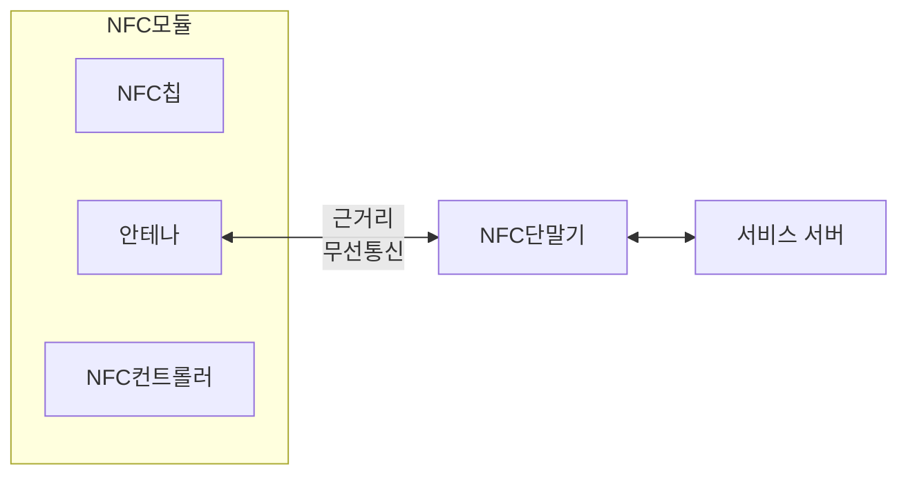

## NFC 개념

- ==13.56MHz== 주파수 대역을 사용하여 ==10cm 이하 근거리==에서 ==양방향 통신==을 지원하는 비접촉식 근거리 무선 통신 기술
- 근거리 편의성, 암호화 보안성, 다양한 기기 호환성

## NFC 구성도, 구성요소, 적용방안

### NFC 구성도

### NFC 구성요소

| 구분 | 내용 | 비고 |
| --- | --- | --- |
| NFC 칩 | 데이터 처리 및 저장 담당 | RF 인터페이스 프로토콜 처리 |
| 안테나 | 데이터 송수신 담당 | 13.56MHz |
| NFC 컨트롤러  | NFC 칩, 안테나 제어 및 통신 관리 | 기기와 연동하여 NFC 기능 제공 |

### NFC 적용방안

| 구분 | 내용 | 비고 |
| --- | --- | --- |
| 공공 | 대중교통요금, 출입통제, 관광정보 | 편의성, 효율성 |
| 금융 | 모바일 결제, ATM 출금, 포인트 적립 | 간편, 안전 결제 |
| 민간 | 제품정보제공, 쿠폰발행, 마케팅 활용 | 고객 혜택, 정보 제공 |

## 무선통신기술 비교

| 구분 | NFC | Bluetooth | Thread |
| --- | --- | --- | --- |
| 주파수 | 13.56MHz | 2.4GHz  | 2.4GHz |
| 거리 | ~10cm | ~50m | ~100m  |
| 전력소비 | 매우 낮음 | 낮음 | 낮음 |
| 속도 | 424kbps | 50mbps | 250kbps |
| 용도 | 결제, 인증, 데이터 교환 | 오디오 스트리밍, 데이터 전송, 웨어러블 디바이스 | 스마트홈 자동화 |

## NFC 적용 고려사항

- 개인정보, 금융정보의 보안을 위해 AES 암호화와 TLS 1.3 기반 통신 기술 적용 필요
