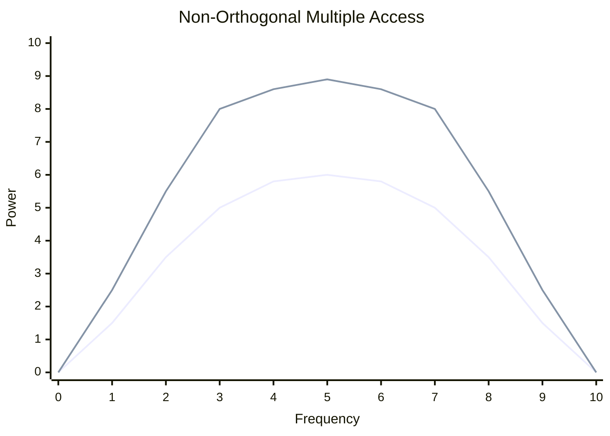

## NOMA 개념

- 동일한 주파수 자원을 다수의 사용자가 동시에 사용하며, 신호의 세기 차이를 이용해 사용자 간 신호를 구별하여 주파수 효율성과 데이터 전송 속도를 극대화하는 차세대 무선 통신 기술
- 증가하는 데이터 트래픽과 다양한 서비스 요구 충족, 주파수 자원의 효율적 사용, 더 많은 사용자 수용 능력, 높은 데이터 전송 속도

## NOMA 개념도, 구성요소, 비교

### NOMA 개념도

- 전력을 제어하여 채널별 주파수를 중첩하여 전송

### NOMA 구성요소

| 구분 | 내용 | 비고 |
| --- | --- | --- |
| 송신기 | 다수 사용자 신호의 전력을 차별화하여 주파수에 담아 전송 | 사용자 채널에 따라 전력 할당 |
| 수신기 | 주파수 세기에 따른 신호 분리 및 복원 처리 | ==SIC== |
| 채널 | 다중 경로 지정 및 간섭 관리 | 주파수 효율성 |

### 기존 주파수 분할 방식과 비교

| 구분 | ODFMA | NOMA |
| --- | --- | --- |
| 원리 | 직교 자원 할당 | 전력 차별 중첩 할당 |
| 주파수 효율 | 상대적 낮음 | 높음 |
| 복잡도 | 낮음 | 높음, 간섭 제거 |
| 직교성 유지 | 중요 | 필요없음 |
| 활용 | 4G | 5G |

## NOMA 고려사항

- 수신기 내부 순차적 간섭 제거로 수신 받을 데이터를 정확하게 처리하는 기술 필요
