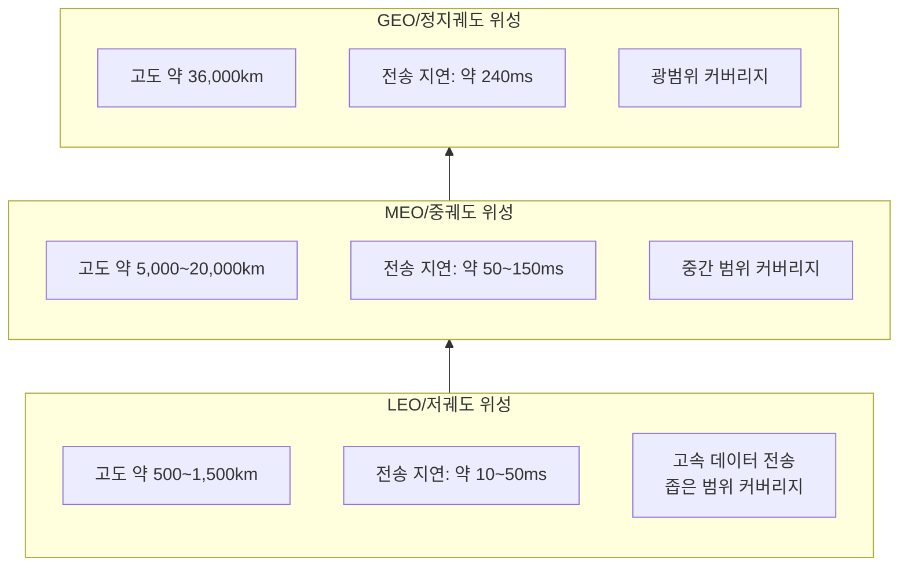
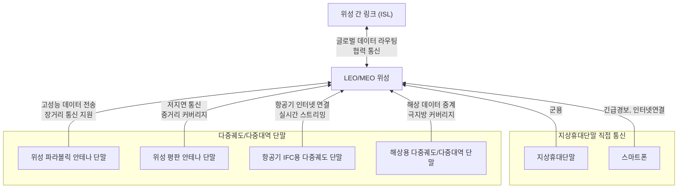

## 위성통신 개요

### 위성통신 개념도

### 비정지궤도 위성통신 개념

- LEO 및 MEO 위성을 활용하여 높은 데이터 전송 속도, 낮은 지연시간, 글로벌 커버리지를 제공하는 통신 기술
- GEO 대비 낮은 전송 지연으로 IoT, 자율주행, 의료 등 다양한 서비스 적합 / LEO 위성 서비스 활성화로 인한 데이터 수요 충족 / 긴급 SOS 메시징 및 극지방 커버리지 등 기존 위성 통신 문제 해결

## 비정지궤도 위성통신 구성도, 구성요소, 기술동향

### 비정지궤도 위성통신 구성도

### 비정지궤도 위성통신 구성요소

| 구분 | 구성요소 | 내용 |
| --- | --- | --- |
| 위성 | LEO/MEO 위성 |저지연, 고속 데이터 전송, 글로벌 커버리지 제공 |
| | 위성 간 링크 (ISL) | 위성 간 데이터 중계 및 글로벌 라우팅 지원 |
| 단말 | 위성 파라볼릭 안테나 단말 | GEO+MEO+LEO 지원, 주로 해상 및 고정형 통신 환경에서 사용 |
| | 위성 평판 안테나 단말 | 위상 배열형 전자적 빔 조향 안테나, 높은 내구성, 다중궤도/다중대역 지원 |
| | 항공기 IFC 단말 | 기내 인터넷 연결, 실시간 스트리밍 지원 |
| | 해상용 단말 | 극지방 커버리지 및 해상 데이터 통신 지원 |
| | 지상 휴대 단말 | 긴급 SOS 메시지, IoT 연동, 위성 직접 통신 |

### 비정지궤도 위성통신 기술동향

| 구분 | 기술동향 | 내용 |
| --- | --- | --- |
| 국내 | LEO 위성 테스트베드 구축 | 2030년까지 시범시스템 확보를 목표로 기술 개발 |
| | 표준화 참여 | 3GPP NTN 표준화 및 위성-지상 통합 기술 개발 |
| 국외 | 스타링크 | 6,100개 이상의 위성을 운영하며 100개국에서 300만 명의 가입자 확보 |
| | Amazon Kuiper | 3,236개의 Ka 대역 위성으로 글로벌 커버리지 구축 계획 |
| | EU IRIS² 프로젝트 | LEO/MEO/GEO 다중 궤도 기반 초고속 통신 서비스 구축 |

## 참조

- [IITP: 주간기술동향 2151호](https://iitp.kr/kr/1/knowledge/periodicalViewA.it?searClassCode=B_ITA_01&masterCode=publication&identifier=1336)
