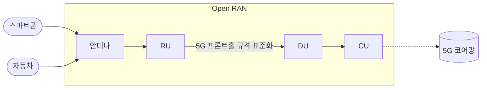
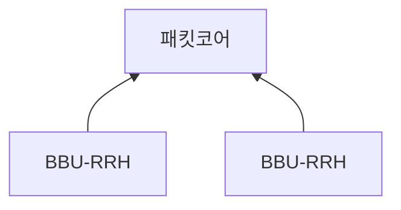
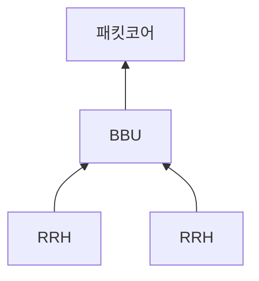
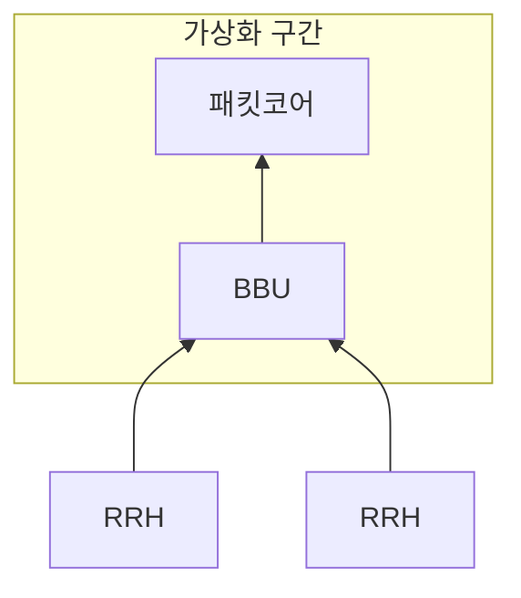
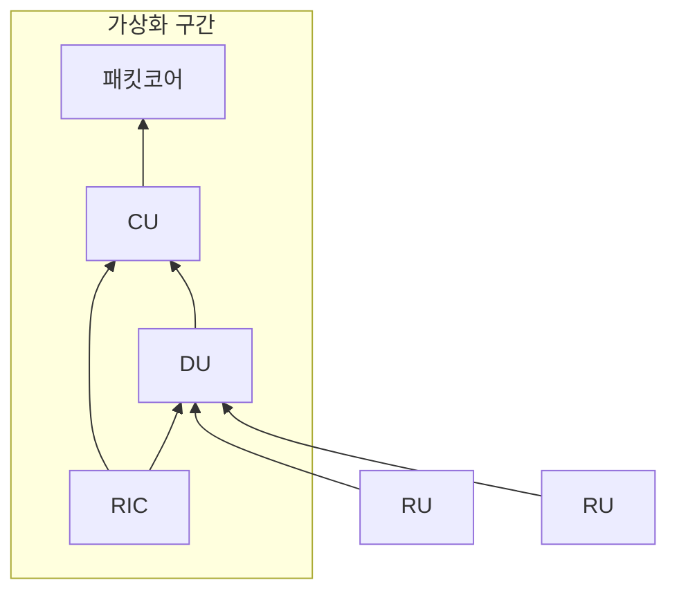

## Open RAN 개념

- 다양한 5G 장비업체 간 호환성, 네트워크 설계 유연성을 위해 기지국 연결 인터페이스와 기지국 OS를 개방하고 표준화한 기술
- 기존 RAN의 단점 극복, 5G 네트워크 설계 유연성 확보, 장비업체 간 경쟁 활성화, 통신 기술 발전, 비용 절감

## Open RAN 구성도, 구성요소, 발전과정

### Open RAN 구성도

### Open RAN 구성요소

| 구분 | 설명 | 비고 |
| --- | --- | --- |
| Radio Unit | 스마트폰 등 통신장비 주파수를 잡아서 연결, 안테나로 받은 라디오 신호 처리 | RF, Low PHY 처리 |
| Distributed Unit | 통신장비에서 요청한 데이터를 전송하는 장치, 라디오 신호에서 디지털 신호 분리 | MAC, RLC, High PHY 처리 |
| Centralized Unit | 네트워크 제어, 사용자 데이터 처리, DU와 CU 간 데이터 전송 | RRC, PDCP 등 프로토콜 활용 |
| RIC | 인공지능 기반, 로드 밸런싱 기반 CU, DU 관리 | 비실시간, 준실시간 |

### Open RAN 발전과정

#### 레거시 비가상화 사이트

#### C-RAN

#### V-RAN

#### O-RAN

