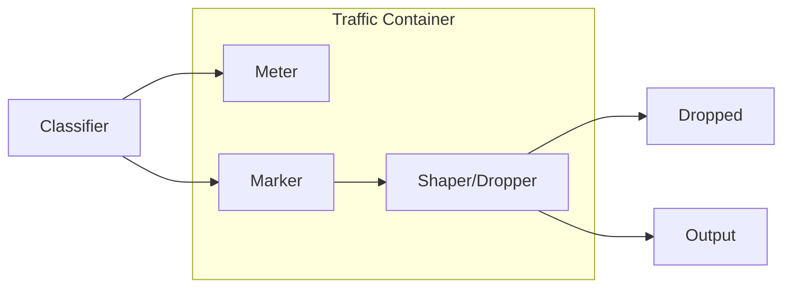
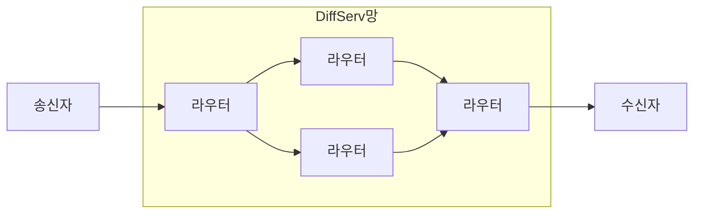

## QoS 개념

- 한정된 네트워크 대역폭을 효율적으로 사용하기 위해 전송품질, 전송속도를 보장하여 종단간 서비스 품질을 향상시키는 기술
- 대역폭, 딜레이, 지터, 패킷로스 등으로 측정

## QoS 보장모델 개념, 특징, 적용사례

### QoS 보장모델 IntServ, DiffServ 개념

- ==IntServ==: QoS 보장을 위해 ==수신자 주도==로 ==경로상의 자원을 미리 예약==하는 기술

- ==DiffServ==: 트래픽을 ==클래스별로 분류==하여 ==차등화==된 서비스를 제공하는 기술

### IntServ, DiffServ 특징 비교

| 구분 | IntServ | DiffServ |
| --- | --- | --- |
| 목적 | 사전 경로지정, 자원 예약 | 트래픽별 서비스 차등화 |
| 특징 | 라우팅 오버헤드 발생 | RSVP 연결비용 절감 |
| 서비스 목표 | 실시간 서비스 트래픽 흐름 지원 | 다양한 서비스 레벨 지원 |
| 엄격한 지연보증 | 보증 가능 | 불가 |
| QoS 구분 | ==RSVP==로 라우터에서 패킷 확인 | ==DSCP== 이용 구분 |
| 규모 | 소규모 | 대규모 |
| 구현복잡도 | 높음, 연결 상태 관리 | 낮음, 분류, 마킹 |

### IntServ, DiffServ 적용방안

- DiffServ는 백본망, IntServ는 주변 소규모망에 적용하여 대규모 네트워크 구간 간 QoS 확보 및 소규모망 내 실시간 성능 확보
