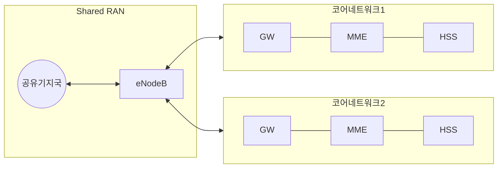

## RAN Sharing 개념

- 여러 이동통신사업자가 하나의 무선 기지국 및 관련 인프라를 공유하여 통신서비스를 제공하는 기술
- 네트워크 투자, 유지 비용 절감, 효율성 증대, 커버리지 확대, 환경보호

## RAN Sharing 구성도, 구성요소, 공공안전망 적용방안

### RAN Sharing 구성도

### RAN Sharing 구성요소

| 구분 | 내용 | 비고 |
| --- | --- | --- |
| eNodeB | 단말과 연결되어 데이터 송수신 | 여러 사업자 단말 수용 |
| MME | 단말의 접속관리, 이동성 관리 | 각 사업자별 독립 구성 |
| GW | 네트워크 간 연결하여 트래픽 송수신 | S-GW, P-GW |
| HSS | 가입자 정보 저장 및 관리 | 사업자 간 가입자 공유 가능 |
| 기지국 | 신호 송수신을 위한 사이트 | 유지보수 비용 분담 |

## RAND Sharing 고려사항

- 3GPP 표준으로 정의된 RAN Sharing 기술 준수 필요
