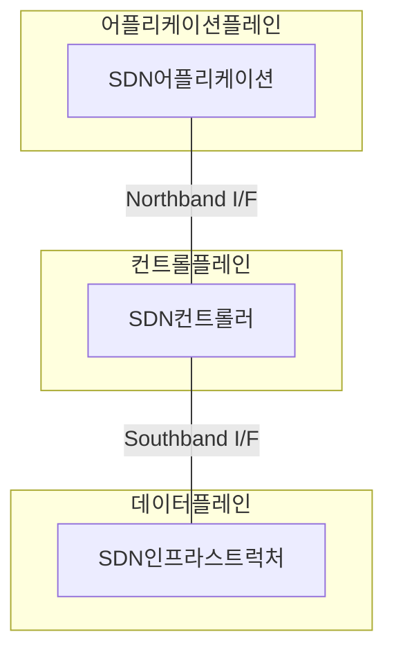
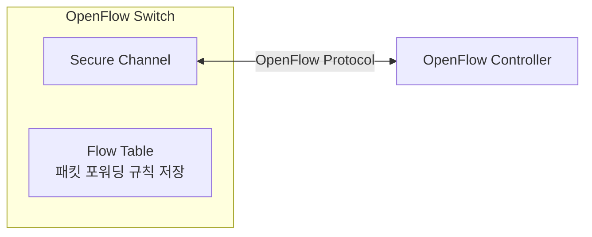

## SDN 개념

- 전통적인 네트워크 구조에서 ==데이터플레인==과 ==컨트롤플레인==을 분리하여 네트워크 장치의 관리와 구성에서 유연성과 성능 효율성을 제공하는 ==소프트웨어 정의 네트워크==
- 네트워크 관리의 복잡성 증가로 인터페이스 분리, 유연한 구성, 확장 가능성, ==자동화==로 인한 휴먼에러 감소

## SDN 구성도, 구성요소, OpenFlow

### SDN의 구성도

### SDN 구성요소

| 구분 | 내용 | 비고 |
| --- | --- | --- |
| SDN 어플리케이션 | 네트워크 서비스 및 애플리케이션 지원 소프트웨어 | 가상화, 모니터링, 보안, 트래픽 최적화 |
| SDN 컨트롤러  | 네트워크 중앙 집중 제어, 정책 설정, 데이터 흐름 제어 | 다양한 프로토콜 사용 통신 |
| SDN 인프라 | 컨트롤러 지시에 따라 데이터 트래픽을 전달하는 네트워크 장비 | 스위치, 라우터 등 |
| Northbound 인터페이스 | SDN 컨트롤러와 어플리케이션 간 통신 인터페이스 | REST API 등 |
| Southbound 인터페이스 | SN 컨트롤러와 인프라 간 통신 인터페이스 | ==OpenFlow== |

### OpenFlow 구성요소

## SDN 강화학습 적용방안

| 구분 | 방안 | 비고 |
| --- | --- | --- |
| ==RL 에이전트== | SDN 컨트롤러 내장, 네트워크 상태 관찰, 행동 결정 | 보상 최대화 학습 |
| ==상태== | 트래픽, 링크 상태, QoS, 요구사항 등 네트워크 환경정보 | 의사결정시 필요 정보 |
| ==행동== | 트래픽 경로 결정, QoS 설정, 로드밸런싱 등 네트워크 제어 | RL에이전트 동작 선택 |
| ==보상== | 네트워크 성능지표, 지연시간, 지터, 처리량, 패킷손실률 등 | 에이전트 행동 피드백 |

## SDN 고력사항

- SDN 컨트롤러는 SpoF 이므로, 컨트롤러 보안 대비 및 고가용성 확보 필요
