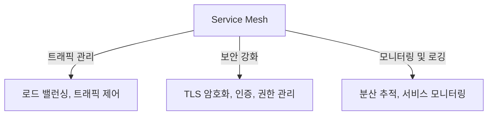

## 서비스메쉬 개념

- 마이크로서비스 환경에서 서비스 간의 통신을 최적화하고 관리하는 구조로, 트래픽 제어, 보안 강화, 모니터링 기능을 제공
- 서비스 간 통신 복잡성 증가 / 보안 요구사항 강화 / 대규모 분산 환경 운영 단순화, 실시간 모니터링

## 서비스메쉬 개념도, 역할, 도입 장점

### 서비스메쉬 개념도

### 서비스 메쉬 역할

| 역할 | 설명 | 예시 |
| --- | --- | --- |
| 트래픽 관리 | 로드 밸런싱, 트래픽 분산, 서비스 디스커버리 지원 | 카나리 배포로 새 버전 점진적 전환 |
| 보안 | 서비스 간 통신 암호화(TLS), 인증 및 권한 부여 | 민감 데이터 처리 API의 보안 강화 |
| 모니터링 | 메트릭 수집, 분산 추적, 로깅 | Istio 텔레메트리를 통한 성능 시각화 |

### 서비스 메쉬 도입 장점

| 문제 | 세부 내용 | 장점 |
| --- | --- | --- |
| 서비스 간 복잡한 통신 | 서비스 간 빈번한 통신으로 인한 복잡성 증가 | 통신 로직을 Service Mesh로 표준화 |
| 보안 취약점 | 네트워크 계층에서의 데이터 유출 위험 | TLS 암호화와 Zero Trust 모델 적용 |
| 운영 문제 | 장애 진단 및 성능 최적화 어려움 | 실시간 모니터링과 분산 추적 활용 |
| 유연한 배포 | 트래픽 제어 및 롤백 어려움 | 카나리 배포, 블루-그린 배포 지원 |

## 서비스 메쉬 주요 도구

| 도구 | 특징 | 활용 사례 |
| --- | --- | --- |
| Istio | 로드 밸런싱, 암호화, 인증 기능 제공 | 금융 서비스의 민감 데이터 보안 강화 |
| Linkerd | 경량화된 트래픽 관리 | 전자상거래 플랫폼의 성능 지표 모니터링 |
| Consul | 서비스 디스커버리 및 네트워크 보안 | 분산 환경에서의 암호화 통신 관리 |
