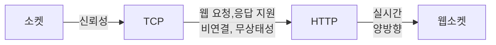
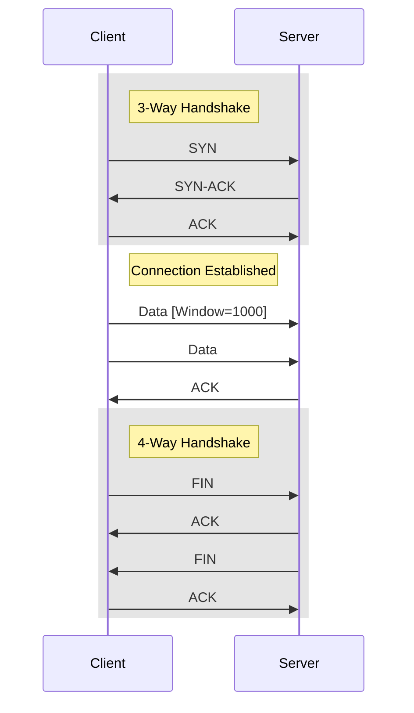
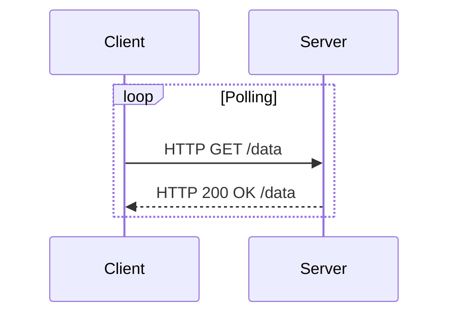
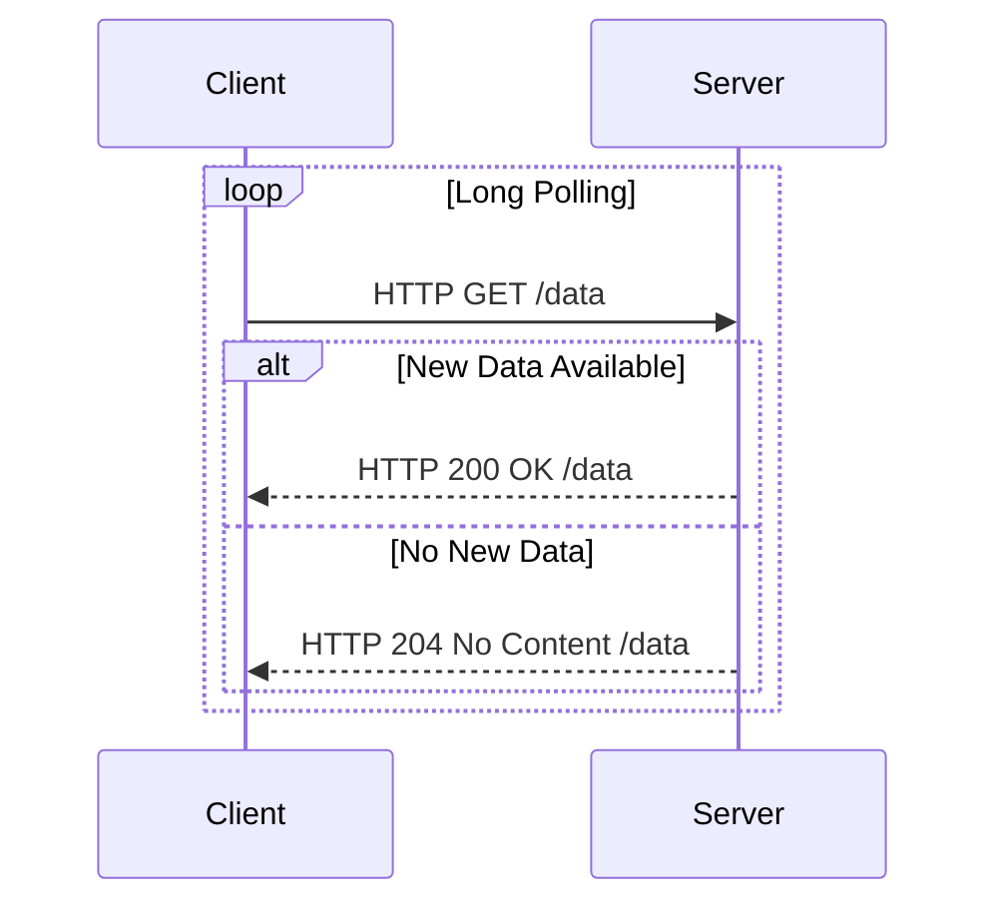
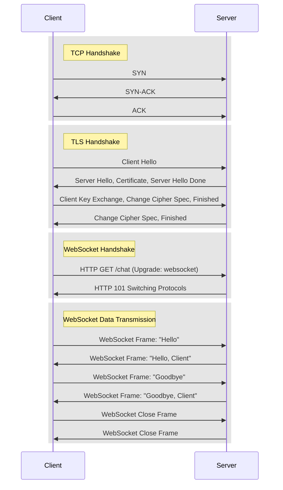

## 소켓 통신의 개요

### 소켓 통신의 개념

- 네트워크 상에서 서로 다른 시스템 간에 데이터를 송수신할 수 있게하는 인터페이스 제공
- IP, Port를 활용하여 통신연결 설정

### 소켓 통신의 특징

| 구분 | 내용 | 비고 |
| --- | --- | --- |
| 양방향 통신 | 데이터 양방향 송수신 가능 | 다양한 데이터 타입 |
| 실시간성 | 연결이 유지되는 동안 실시간 송수신 | 지연시간 최소화 |
| 프로토콜 독립적 | 다양한 네트워크 프로토콜 사용 가능 | TCP, UDP |

## TCP 소켓 구성도, 특징

### TCP 소켓 구성도

### TCP 소켓 특징

| 구분 | 내용 | 비고 |
| --- | --- | --- |
| 신뢰성 | 데이터 손실 없이 정확히 전달 보장 | 순서보장 |
| 연결지향 | 통신 전 연결 설정 후 종료까지 유지 | 재연결 오버헤드 |
| 흐름제어 | 데이터 흐름제어로 수신자 처리속도 맞춤 설정 | 송수신 속도 불일치 해결 |

## HTTP 개념, 실시간 통신 기법

### HTTP 개념

- 요청, 응답 단일요청을 위해 비연결성, 무상태성, 효율성 특징
- 실시간 데이터 통신을 위해 폴링, 롱폴링 기법 사용

### HTTP 실시간 통신 기법

- HTTP 헤더 및 커넥션 오버헤드 증가로 HTML5에서 웹소켓으로 표준화 진행

#### 폴링

#### 롱폴링

## 웹소켓

- 전이중통신, 지속연결, 확장성
- 초기 핸드쉐이킹 비용이 크므로 DNS캐시, TLS 인증서 캐시, HSTS 등 연결 비용 감소 기법 활용
