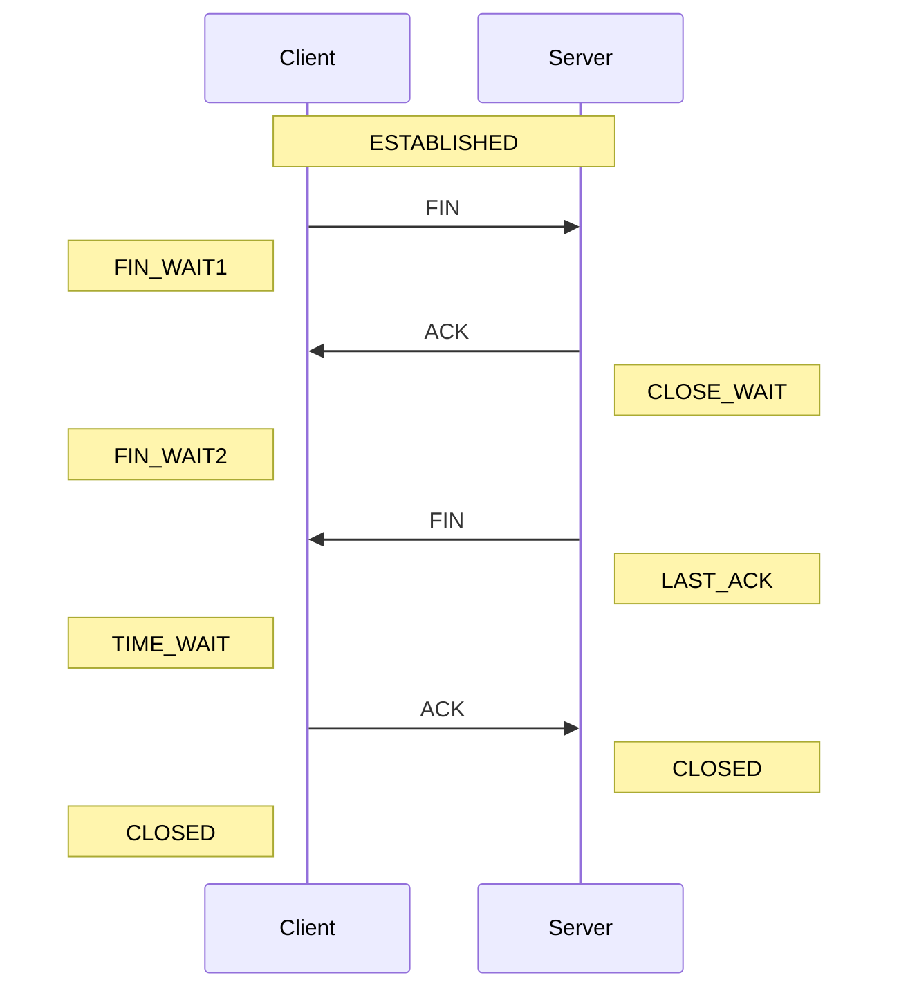
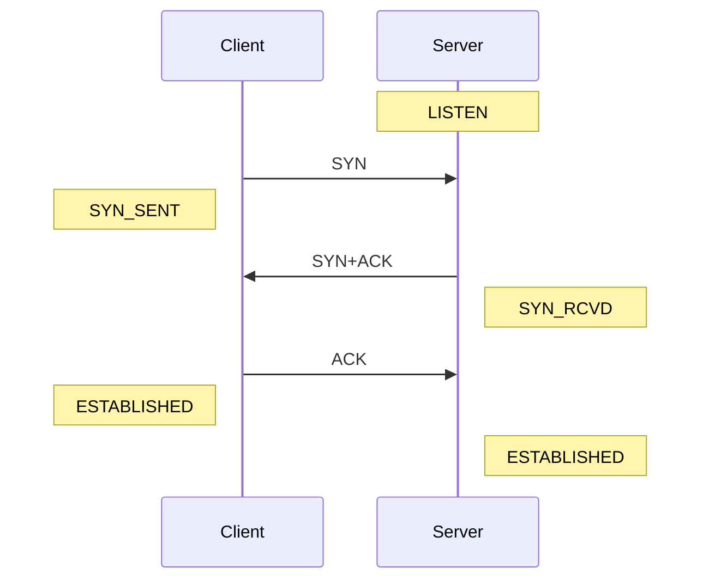

## TCP 4-way 핸드쉐이킹 개념

- TCP 장치들 사이에 논리적으로 성립된 연결을 해제하는 프로세스
- 데이터 유실 방지, TIME_WAIT 제공

## TCP 4-way 핸드쉐이킹 과정

### TCP 4-way 핸드쉐이킹 절차도

### TCP 4-way 핸드쉐이킹 세부 절차

| 구분 | 절차 | 설명 |
| --- | --- | --- |
| Client | FIN_WAIT1 | 클라이언트가 연결 종료를 위한 FIN 플래그 전송 후 ACK, FIN 수신 대기 |
| Server | CLOSE_WAIT | ACK 전송 후 어플리케이션 종료 대기, Close socket 후 FIN 전송 |
| Client  | FIN_WAIT2 | 서버로부터 FIN 수신 후 ACK 전송, 타이머 시작 |
| Server | LAST_ACK | 클라이언트로부터 ACK 수신 후 타이머 시작, 연결 종료 |
| Client | TIME_WAIT | 타이머 종료 후 연결 종료, TIME_WAIT 상태로 대기 |
| | CLOSED | 서버, 클라이언트 연결 종료 |

## TCP 3-way 핸드쉐이킹 과정

### TCP 3-way 핸드쉐이킹 절차도

### TCP 3-way 핸드쉐이킹 세부 절차

| 구분 | 절차 | 설명 |
| --- | --- | --- |
| Client | SYN_SENT | 서버에게 연결 요청을 위한 SYN 패킷 전송 |
| Server | SYN_RCVD | 클라이언트로부터 SYN 패킷 수신 후 ACK, SYN 패킷 전송 |
| Client | ESTABLISHED | 서버로부터 ACK, SYN 패킷 수신 후 ACK 패킷 전송, 연결 성립 |
| Server | ESTABLISHED | 클라이언트로부터 ACK 패킷 수신 후 연결 성립 |

## TCP 제어 플래그 설명

| 구분 | 제어 플래그 | 설명 |
| --- | --- | --- |
| 긴급할당 | URG | 송신 측 상위 계층의 긴급 데이터 확인시 1 설정 |
| 확인응답 | ACK | 1 확인번호 유효, 0 확인번호 미포함 |
| 버퍼데이터공간 | PSH | 버퍼링 데이터를 상위 계층으로 즉시 전달 |
| 연결초기화 | RST | 연결 확립된 세션을 강제 리셋 요청 |
| 연결시작 | SYN | TCP 연결설정 시 순서번호를 동기화 |
| 연결종료 | FIN | 송신 측 연결 종료 요청 |

- 3way는 SYN, SYN+ACK, ACK 사용, 4way는 FIN, ACK 사용
