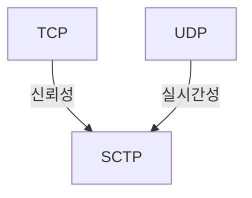

## 통신 프로토콜의 개념



- 디지털 정보를 전송계층에서 포트 기반으로 전송하기 위한 세그먼트 표준 규약
- TCP의 핸드쉐이킹으로 인한 신뢰성과 UDP의 데이터그램으로 인한 실시간성의 장점을 결합하여 멀티호밍, 멀티스트리밍 기반 SCTP 프로토콜로 발전

## TCP, UDP, SCTP

### TCP 개념 및 특징

```bash
# TCP 헤더
+-----------------+-----------------+
|  소스 포트        |  목적지 포트       |
+-----------------+-----------------+
|      시퀀스 번호                     |
+-----------------------------------+
|      ACK 번호                      |
+-----------------+-----------------+
|    길이  |   플래그   |   윈도우 크기  |
+-----------------+-----------------+
|    체크섬         |   긴급 포인터     |
+-----------------+-----------------+
|      옵션                          |
+-----------------------------------+
|                                   |
|              데이터                 |
|                                   |
+-----------------------------------+
```

- 개념: 신뢰성과 순서를 보장하는 연결지향 프로토콜
- 특성: ==흐름제어==, ==혼잡제어==, ==전이중통신==, ==연결지향==

### UDP 개념 및 특징

```bash
# UDP 헤더
+-----------------+-----------------+
|  소스 포트        |  목적지 포트       |
+-----------------+-----------------+
|     길이         |     체크섬        |
+-----------------+-----------------+
|                                   |
|              데이터                 |
|                                   |
+-----------------------------------+
```

- 개념: 데이터 전송 속도를 우선시하는 비신뢰성 비연결지향 프로토콜
- 특징: ==비신뢰성==, ==비연결지향==, ==단순성==, ==실시간성==

### SCTP 개념과 특징

```bash
# SCTP 헤더
+-----------------+-----------------+
|  소스 포트        |  목적지 포트       |
+-----------------+-----------------+
|  검증 태그        |  체크섬           |
+-----------------------------------+
|         청크 헤더1                  |
+-----------------------------------+
|            데이터1                 |
+-----------------------------------+
|         청크 헤더2                  |
+-----------------------------------+
|            데이터2                 |
|              ...                  |
+-----------------------------------+
```

## TCP, UDP, SCTP 비교

| 구분 | TCP | UDP | SCTP |
| --- | --- | --- | --- |
| 연결방식 | 3way - 4way | 없음 | 4way - 3way |
| 데이터 단위 | 세그먼트 | 데이터그램 | 데이터 청크 |
| 신뢰성 | 높음 | 낮음 | 높음 |
| 순서보장 | 보장 | 없음 | 보장 |
| HoL블로킹 | 발생 | 없음 | 없음, 멀티스트리밍 |
| 속도 | 느림 | 빠름 | 중간 |
| 다중경로 | 미지원 | 미지원 | 지원 |
| 용도 | 웹, 이메일, 파일전송 | 실시간 스트리밍, DNS, 로깅 | VoIP, 위성통신, MMORPG |
| 장점 | 신뢰성, 무결성 | 속도, 실시간성 | 신뢰성, 기능안정성 |
| 단점 | 느린 속도, 실시간성 | 신뢰성, 데이터손실 | 복잡한 구조, UDP보다 느린 속도 |
