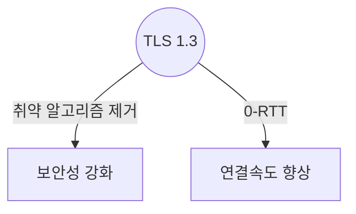
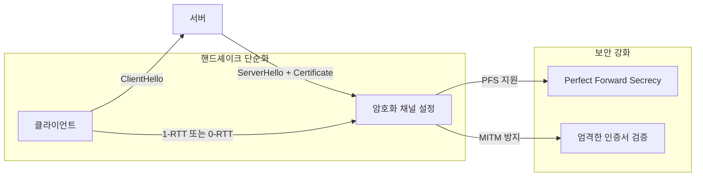

## TLS 1.3 개념

- 인터넷 통신에서 데이터를 암호화하고 무결성을 보장하는 프로토콜로 1.3버전에서 보안성과 성능을 크게 개선

## TLS 1.3 개념도, 개선 내용, 적용 사례

### TLS 1.3 개념도

### TLS 1.3 개선 내용

| 변경 사항 | 설명 | 예시 |
| --- | --- | --- |
| 암호화 강도 강화 | 취약한 알고리즘 제거, AES-GCM, ChaCha20-Poly1305 채택 | RC4, SHA-1 제거 |
| 핸드쉐이크 간소화 | 1-RTT 기본 적용, 0-RTT 재접속 지원 | 초기 연결 시 속도 향상 |
| PFS 기본 지원 | Diffie-Hellman(ECDHE) 사용으로 세션 키 고유화 | 세션 키 유출 시 타 세션 보호 |
| MITM 공격 방지 | 엄격한 인증서 검증 | 중간자 공격 가능성 차단 |
| 레거시 프로토콜 제거 | TLS 1.0, 1.1 제거 | 최신 보안 요구사항 반영 |

### TLS 1.3 적용 사례

| 분야 | 적용 사례 | 효과 |
| --- | --- | --- |
| 웹 브라우저 | Chrome, Firefox 등에서 기본 지원 | HTTPS 보안 강화 |
| 클라우드 서비스 | AWS, Google Cloud에서 TLS 1.3 활용 | 데이터 보호 및 성능 개선 |
| VPN | OpenVPN, WireGuard에서 TLS 1.3 적용 | 안전한 원격 접속 |

## TLS 발전방향

- 양자내성암호와 결합하여 TLS 보안성이 더욱 강화될 것으로 기대
