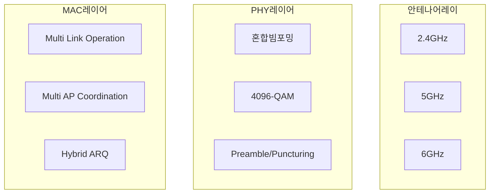

## WiFi 7 개념

- 46Gbps의 최대 전송률과 2.4, 5, 6GHz 무선 대역에서 초실감 컨텐츠를 전송하기 위한 IEEE 802.11be 표준 무선통신 기술

## WiFi 7 구성도, 구성요소

### WiFi 7 구성도

### WiFi 7 구성요소

| 구분 | 구성요소 | 설명 |
| --- | --- | --- |
| MAC | MLO | 서로 다른 주파수 대역을 동시 활용하여 지연 감소 및 처리량 증대 |
| | Multi AP Coordination | 주변 AP와 데이터 공유를 통해 전파 간섭 최소화, 전체 네트워크 성능 및 커버리지 개선 |
| | H-ARQ | FEC, BEC를 결합하여 오류제어 및 재전송 |
| PHY | 혼합 빔포밍 | 320MHz 광대역을 다수 협대역으로 분할하여 프리코딩 |
| | 4096-QAM | 기존 대비 4배 많은 비트 전송, 20% 성능향상|
| | Preamble/Puncturing | 특정 서브 채널을 제외하거나 활용하여 채널 효율 개선, 간섭 최소화 |

## WiFi 6, 7 비교

| 구분 | WiFi 6 | WiFi 7 |
| --- | --- | --- |
| 표준 | IEEE 802.11ax | IEEE 802.11be |
| 최대전송속도 | 9.6Gbps | 46Gbps |
| 최대대역폭 | 160MHz | 320MHz |
| 변조방식 | 1024-QAM | 4096-QAM |
| MU-MIMO | 8x8 | 16x16 |
| 적용기술 | OFDMA, MU-MIMO | MLO, H-ARQ, Multi AP |
| 주파수 | 2.4, 5, 6GHz (6E) | 2.4, 5, 6GHz |
| 타겟 서비스 | 고화질 스트리밍, 스마트홈, 대규모 밀접시설 | AR, VR, 8K 스트리밍, 초저지연 무선통신 |
