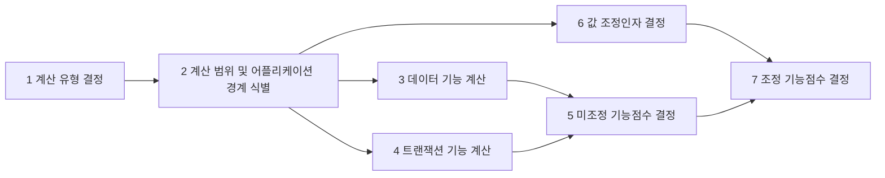

## 기능점수 개념

- 논리적 설계를 기초로 SW기능을 정량화하고 계수적 측정을 통한 실험적 관계를 통해 개발 규모를 산정하는 방법
- 사용자의 요구사항으로부터 SW비용 산정 가능, ISO 14143 활용

## 기능점수 측정 절차, 계산 요소, 기법

### 기능점수 측정 절차

### 기능점수 계산 요소

| 구분 | 내용 | 예시 |
| --- | --- | --- |
| ==EI== | 등록, 수정, 삭제되는 기능 입력 | 사용자 정보 CUD |
| ==EO== | 통계, 출력되는 기능 입력 | 방문자 통계, 합계 |
| ==EQ== | 조회 기능 입력 | 사용자 조회 |
| ==ILF== | 테이블 정보 입력 | 회원 정보 |
| ==EIF== | 타 시스템 연계 테이블 정보 입력 | 지하철 노선 정보 |

### 기능점수 간이법, 정통법 비교

| 구분 | 간이법 | 정통법 |
| --- | --- | --- |
| 측정항목 | 데이터 기능, 트랜잭션 수 | 데이터 필드 수, 연계 테이블, 트랜잭션 수 |
| 복잡도 | 평균 복잡도 | 기능별 복잡도 |
| 장점 | SW규모 측정 간소화, 신속한 규모 측정 | 정확한 규모 측정, 경험DB 축적, 재사용 |
| 단점 | 제한적 데이터 재활용, 상대적 낮은 정확도 | 사업 초기 적용 어려움, 러닝 커브 |
| 적용시기 | 개발 요건 정의시 모든 단계에서 적용 가능 | 개발 요건 및 요건별 상세설계 제공 이후 |

- 개발 초기 제안, 개발 단계에서 간이법을 개발 완료 후 비용 정산시 정통법 주로 사용

## 기능점수 고려사항

- 기능점수 산출이 어려운 자율 주행 등 융합IT 영역에서의 대책 또는 가이드 수립 필요
