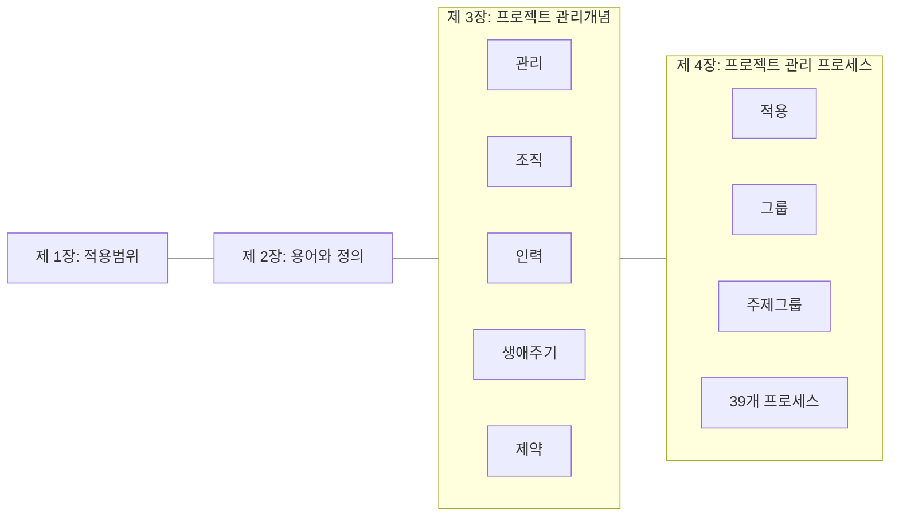

## ISO 21500 개념

- 프로젝트 관리에 대한 원칙과 프로세스를 제공하는 국제 표준
- 다양한 산업 및 조직에서 프로젝트 관리에 대한 일관성 및 효율성 제공, 프로젝트 성공률 향상

## ISO 21500 구성도, 구성요소, 적용방안

### ISO 21500 구성도

### ISO 21500 구성요소

| 구분 | 내용 | 비고 |
| --- | --- | --- |
| 착수 | 프로젝트 시작시 프로젝트 목적 정의, PM 임명 | 프로젝트 헌장, 이해관계자 식별 |
| 기획 | 세부 계획 수립, 성과 측정 기준선 수립 | 프로젝트 기획 수립, 범위, 일정, 비용 추정 |
| 이행/실행 | 프로젝트 관리 활동 수행, 계획에 따른 프로젝트 실행 | 프로젝트 작업 지시, 품질 보증 수행 |
| 통제 | 프로젝트 실적 모니터링, 측정, 통제, 예방, 변경 요청 | 프로젝트 작업통제, 변경 통제 |
| 종료 | 프로젝트 완료, 문서 정리 | 최종 보고서 작성 |

### ISO 21500 적용방안

| 구분 | 내용 | 비고 |
| --- | --- | --- |
| 평가 및 계획 | 조직 현재 프로젝트 관리체계 평가 및 개선 계획 수립 | AS-IS 절차 문서화, 평가 |
| 교육 및 도입 | ISO 21500에 따른 교육 및 인식 제고 | 워크숍, 세미나 |
| 실행 및 모니터링 | 표준에 따른 프로세스 실행 및 지속적 관리 | 정기적인 검토 |

## ISO 21500 도입시 고려사항

- 조직에 특성에 맞는 테일러링 필요
