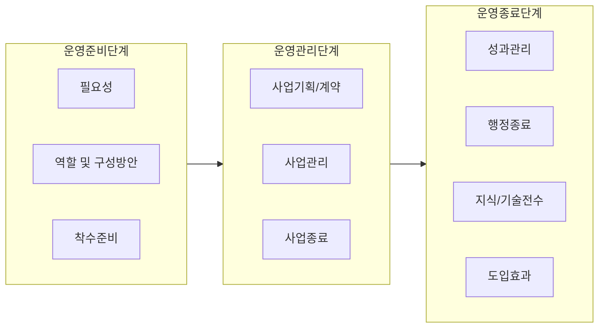

## PMO의 개요

### PMO의 개념

- 조직차원에서 프로젝트 포트폴리오 관리를 위하여 프로젝트를 지속적으로 모니터링, 프로세스 및 방법론 표준화, 기술적 지원 등을 수행하는 프로젝트 관리 조직

### PMO 도입 배경

- 대기업 SI회사의 공공사업 참여가 제한되어 중소기업의 참여 기회가 확대되었으나, 사업관리 경험과 전문인력이 부족하기에 SW사업관리 역량과 성공율을 제고하기 위한 목적으로 도입

## 전자정부 PMO 프레임워크의 구성도, 구성요소, 사례

### PMO 프레임워크 구성도

### PMO 프레임워크 구성요소

| 구분        | 내용                              | 비고                                                                                             |
| ----------- | --------------------------------- | ------------------------------------------------------------------------------------------------ |
| PMO운영준비 | PMO 도입 및 운영 준비를 위한 활동 | 필요성, 역할, 착수 준비                                                                          |
| PMO운영관리 | PMO의 핵심 관리 활동              | 계획, 계약, 발주, 통합, 범위, 일정, 위험, 품질, 인적자원. 의사소통, 하도급, 완료검사, 인수, 종료 |
| PMO운영종료 | PMO 운영 종료 및 성과 정리        | 성과 관리, 행정적 종료, 지식 전수, 기대효과                                                      |

### PMO 도입 사례

| 구분                           | 내용                                                         | 비고                        |
| ------------------------------ | ------------------------------------------------------------ | --------------------------- |
| 국세청 홈택스 시스템 개선      | 시스템 개선 전반 과정 관리, 사용자 중심 서비스 개선          | 국민 편의 증진              |
| 차세대 사회보장정보시스템 구축 | 복잡한 이해관계, 사업 범위, 하도급 관리로 대규모 시스템 구축 | 대규모 복지시스템 구축 사업 |

## PMO 고려사항

- 발주기관 및 참여사업자의 원활한 의사소통 관리
- 단계별 철저한 작업 계획 수립과 작업 진행에 대한 이슈 관리
