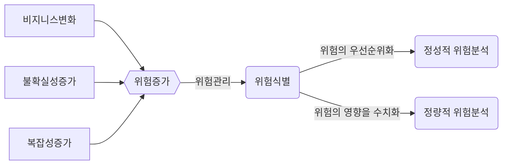
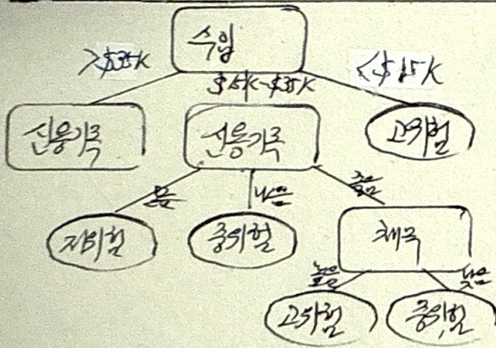
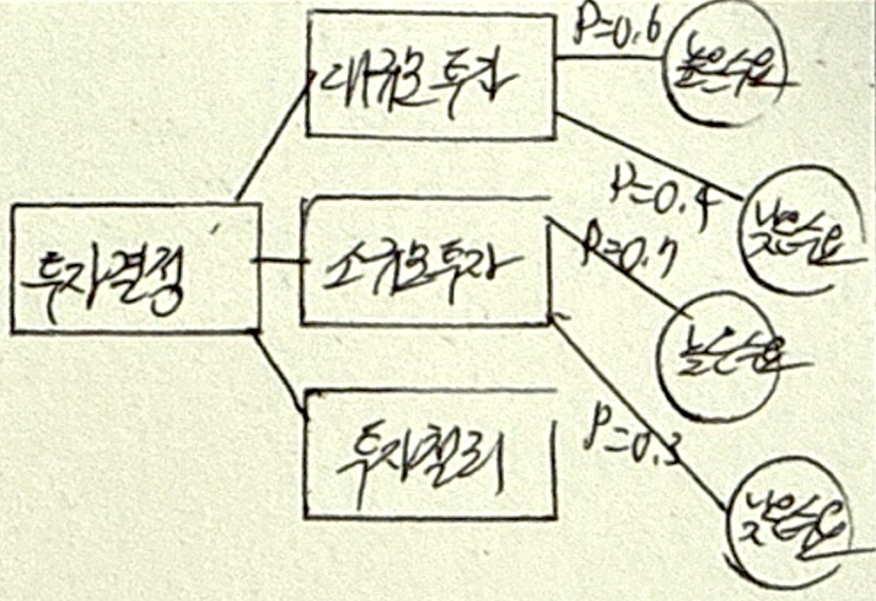
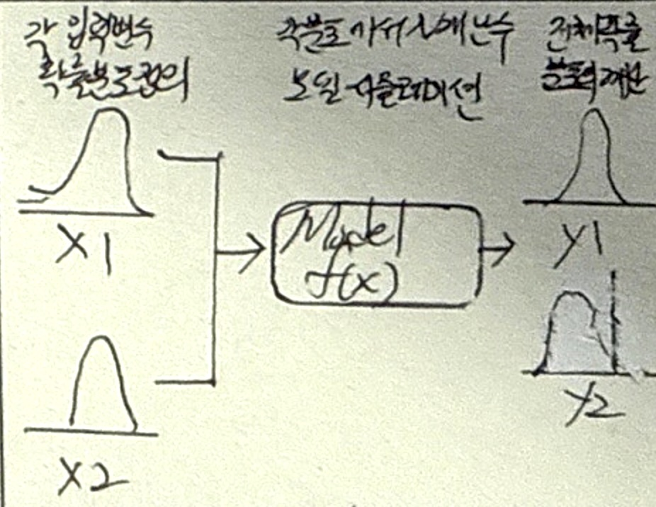

## 위험분석 개념

- 정성적 위험 분석
  - 전문가 판단
  - 위험 영향 분석
  - 위험 범주 분류
- 정량적 위험 분석
  - 의사결정나무 분석
  - 금전적 기대값 분석
  - 몬테카를로 시뮬레이션

## 위험분석 유형

### 의사결정나무 분석

| 구분 | 내용 |
| --- | --- |
| 개념도 |  |
| 개념 | 의사결정규칙을 도표화하여 관심 대상 집단을 소집단 분류 후 분석하는 기법 |
| 특징 | 수입규모와 신용기록의 좋고 나쁨에 따른 위험도 분석 |

### 금전적 기대값 분석

| 구분 | 내용 |
| --- | --- |
| 개념도 |  |
| 개념 | 발생가능 시나리오 따른 미래가치를 통계적 계산하여 기대가치가 더 높은 시나리오를 선택하는 기법 |
| 특징 | 의사결정나무 기반 발생확률과 영향력을 모두 고려하여 분석 |

### 몬테카를로 시뮬레이션 분석

| 구분 | 내용 |
| --- | --- |
| 개념도 |  |
| 개념 | 해를 구하기 어려운 문제를 확률모형과 난수를 이용하여 해를 얻는 시뮬레이션 방법 |
| 특징 | 난수생성 후 패턴을 도출하여 목표함수의 확률변수들의 확률분포를 추정 |
