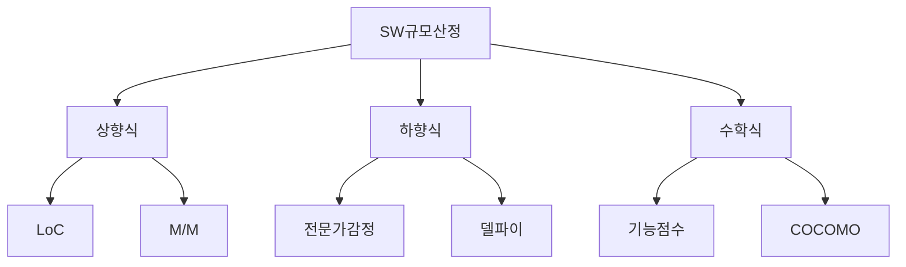

## 소프트웨어 규모산정 개념

- SW개발 프로젝트의 크기와 복잡도를 평가하여 개발 계획 수립에 필요한 비용을 산정하는 기법
- 현실적 일정, 계획, 예산 반영으로 프로젝트 추적 관리 가능

## 소프트웨어 규모산정 구성도, 주요 기법, 적용방안

### 소프트웨어 규모산정 구성도

### 소프트웨어 규모산정 주요 기법

| 구분 | 규모산정 종류 | 내용 | 비고 |
| --- | --- | --- | --- |
| 상향식 | LoC | 소스 코드 라인수 측정, 기대치, 낙관치, 비관치로 예측치 반영 | 측정 단순 |
| | M/M, 맨먼스 | 한 사람이 한 달동안 작업하면 되는 양으로 공수 측정 | 사람 * 시간 |
| 하향식 | 전문가 감정 | 유사 경험으로 단언하여 측정 | 주관적, 부정확 가능성 |
| | 델파이 | 주관적 편견을 보완하기 위해 많은 전문가 의견을 종합 산정 | 추가 자문 비용 |
| 수학식 | 기능 점수 | 사용자 관점에서 SW개발 규모 측정을 위해 기능 정량화 후 계수적 측정 | 간이법, 정규법 |
| | COCOMO | 시스템을 구성하는 모듈과 서브시스템 비용 합계를 계산하여 측정 | 알고리즘 사용 |

- 재사용을 중시하는 SW개발 방법론의 진화에 따라 LoC에서 FP, COCOMO 방식 대두

### 소프트웨어 규모산정 적용방안

| 구분 | 방안 | 내용 |
| --- | --- | --- |
| 대규모 프로젝트 | COCOMO | 대규모 연구개발 프로젝트의 수학적 비용 산정 |
| 중소규모 프로젝트 | FP | 요구사항 기반으로 일관성 있는 규모산정 |
| 임베디드 프로젝트 | LoC | 라인 수 기반으로 시스템 크기 추정 |

## 공공SW사업 규모산정방식 현실적 개선방안

### 비용, 제도 측면 개선방안

| 구분 | 개선방안 | 내용 |
| --- | --- | --- |
| 비용 | SW단가 현실화 | SW직종 인건비 고려 단가 현실화, IT 지식재산권 인정 |
| | 사후 정산 체계 확립 | 사업종료시 과업 변경따른 증감 부분에 대한 추가비용 고려 |
| 제도 | 과업심의위원회 실효성 확보 | 발주자, 사업자 간 과업심의위원회 역할 강화 |
| | 신기술적용 대가기준 수립 | AI, 빅데이터, 클라우드 등 신기술에 대한 기준 검토 |

### 자원, 생산성 측면 개선방안

| 구분 | 개선방안 | 내용 |
| --- | --- | --- |
| 자원 | 전문가 도입 | 도메인 전문가 ,기술 전문가, 프로젝트관리 전문가 등 다양한 전문가 참여 강화 |
| | 산정SW 도입 | SW규모 측정도구 도입 및 활용 |
| 생산성 | 개발자능력확인 | 경험, 전문지식 습득 등 전문 개발자 능력 확인 |
| | 개발방법론 | 최신기법, 개발방법론, 관리방법론 등 프로젝트 방법론 도입 확인 |

## 소프트웨어 규모산정시 고려사항

- 비기능적 요구사항도 평가지표에 포함하여 정확한 규모산정 필요
