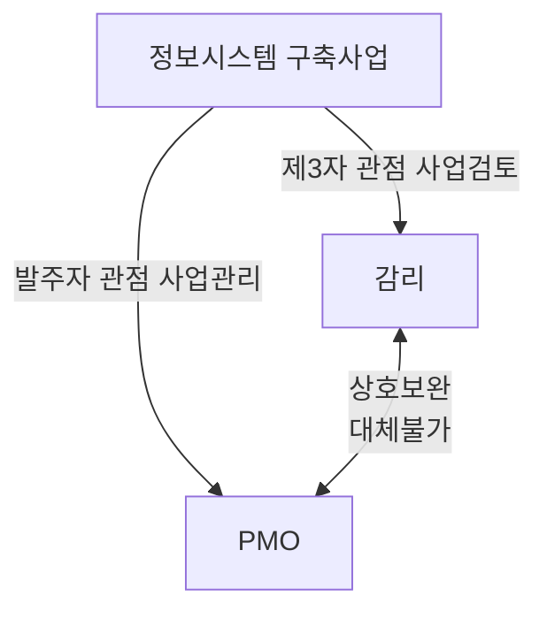

## 정보시스템 감리와 PMO 개요

- PMO는 사전적, 감리는 사후적 대응으로 프로젝트를 관리하는 상호보완적 관계

## 정보시스템 감리와 PMO 개념, 절차, 특징

### 감리, PMO 개념 비교

| 구분 | 감리 | PMO |
| --- | --- | --- |
| 개념 | 정보시스템 구축 사업의 법적 요구사항 준수, 품질 확보 | 정보시스템 구축 사업의 효율적인 관리 및 성공을 위한 전문 지원 조직 |
| 근거 | 전자정부법 제 57조 1항 | 전자정부법 제 64조 2항 |

### 감리, PMO 절차 비교

| 구분 | 감리 | PMO |
| --- | --- | --- |
| 사업준비 | 감리 계약 체결, 감리 계획 수립 | PMO 설치 계획 수립, 인력 구성 |
| 사업 착수 | 착수 회의, 사업 계획 검토 | PMO 착수 회의, 사업 계획 수립 지원 |
| 사업 진행 | 정기/수시 점검, 산출물 검토, 테스트 지원 | 사업 진행상황 관리, 품질/위험 관리 지원 |
| 사업 종료 | 최종 감리보고서 작성, 감리 결과 보고 | 최종 PMO 보고서 작성, PMO 종료 |

### 감리, PMO 특징 비교

| 구분 | 감리 | PMO |
| --- | --- | --- |
| 목적 | 기술적 품질 보증 | 프로젝트 관리 |
| 관점 | 제 3자 관점, 독립적 | 발주자 관점 |
| 권고, 의무 | 의무사항 | 권고사항 |
| 방법론 | 감리점검가이드 | PMBOK |
| 성과측정 | 품질준수율, 법규위반건수 등 | 프로젝트 성공률, ROI 등 |
| 인력구성 | 상주감리, 현장감리, 품질관리전문가 등 | 프로젝트 관리 전문가, 비지니스 분석가 등 |
| 보고체계 | 발주처, 관련 정부기관 | 조직 경영진 |
| 주요 산출물 | 감리계획서, 감리 수행결과 보고서, 시정조치 확인서, 품질검사 결과서 | 프로젝트관리 계획서, 리스크 분석 보고서, 사업자 관리 계획서 |
