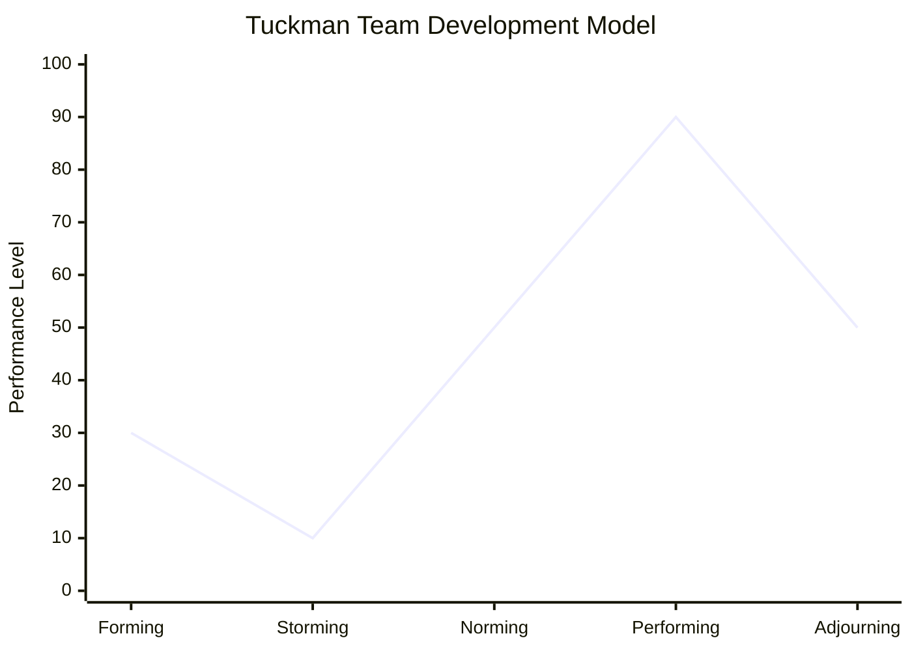

## 터크만 사다리 모델의 개념

- 프로젝트 수행 시 팀 개발 과정을 형성, 스토밍, 표준화, 수행, 해산의 5단계로 표현한 모델
- 조직이 성장하고 도전에 대응하고 문제의식을 갖고 해결책을 찾으며 작업계획을 세우고 결과를 만들기
위하여 필요한 팀 개발 방법론

## 터크만 사다리 모델의 구성도, 특징, 적용방안

### 터크만 사다리 모델의 구성도

- 세부 단계별 프로젝트 팀의 관심과 리더십, 필요 활동 상이

### 터크만 사다리 모델의 단계별 특징

| 단계 | 주요 관심 | 리더십 | 필요 활동 |
| --- | --- | --- | --- |
| 형성기 | 상호 인식 | 지시형 | 팀 방향 설정 |
| 혼돈기 | 갈등 처리 | 지도형 | 계획, 역할 명료화 |
| 규범기 | 협력 관계 구축 | 참여형 | 업무, 역할 몰입 |
| 성취기 | 생산성 증대 | 위임형 | 수행 관리, 평가 |
| 해산기 | 과업종료 | 지시형 | Lesson Learned |

### Performing 단계 진입 촉진을 위한 적용방안

| 기법 | 설명 | 비고 |
|---|---|---|
| Ground Rule | 팀 내 규범을 설정하여 성과를 저해하는 요소를 사전에 제거 | 팀워크, 협업촉진 |
| RACI | 각 구성원의 역할과 책임을 명확하게 정의 | 업무 소통 효율화, 책임 소재 명확화 |
| 1-on-1 | 리더와 팀원이 정기적으로 1:1 미팅을 통해 개인 성과 및 문제를 논의 | 개인성장촉진,의사소통강화 |
| OKR | 목표와 주요 결과를 설정하여 팀과 개인의 방향성을 명확화 | 성과측정, 조직비전일치 |
