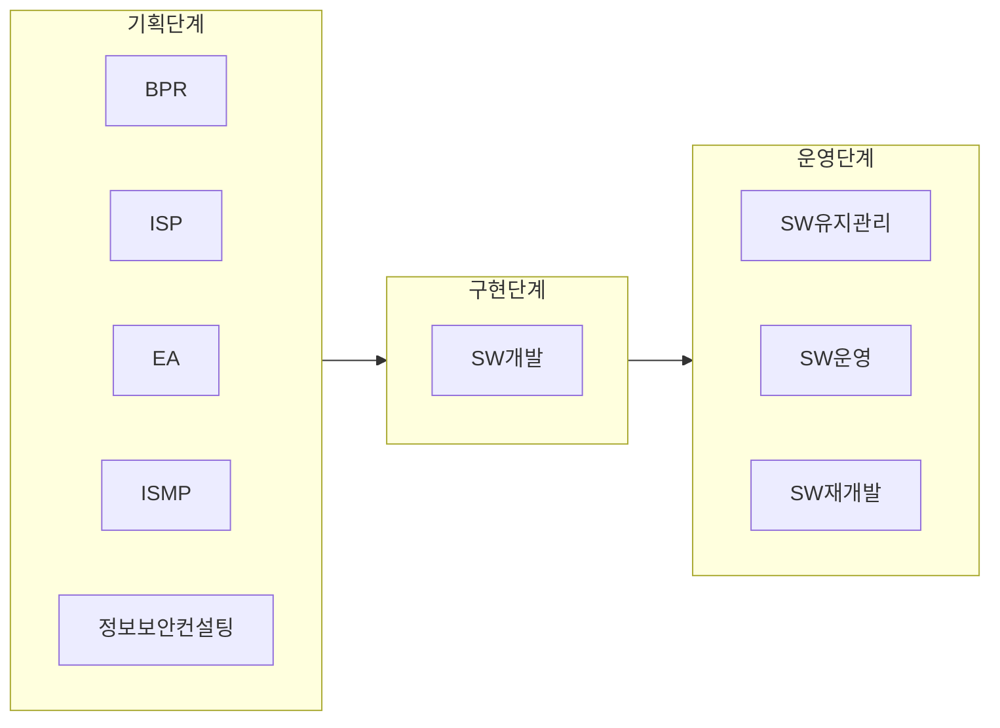

## 운영단계 대가산정 개념

- ==SW진흥법 제 10조== 의거, SW수명주기 중 ==운영단계 사업 및 서비스의 적정대가를 산정하기 위한 지침==

## 운영단계 대가산정 방식

### 응용SW요율제 유지관리비 산정방식

| 구분 | 내용 | 산출물 |
| --- | --- | --- |
| 1 사전준비 | 유지관리 대상 SW 식별 | 유지관리 대상 SW |
| 2 ==유지관리대상 SW 개발비 재산정== | 유지관리 대상 SW 개발비를 유지관리 계약적정 FP와 단가로 재산정 | SW개발비 (현재가치) |
| 3 ==유지관리 총량 계산== | 유지관리횟수, 시스템사용자수, 시스템중요도, 연계, 오류복구신속성 따른 난이도 계산 후 반영 | 총 유지관리점수 (TMP) |
| 4 ==유지관리 운용예산== | 총 건수, 미충 요율 계산 | 유지관리 요율 |
| | 요율 = 10 + 5TMP/100 | |
| 5 ==직접경비 계산== | 유지관리실제소요 경비산정 | 직접 경비 |
| 6 SW 유지관리비 산정 | SW유지관리비 산정 | SW 유지관리비 |
| | SW개발비 * 유지관리요율 + 직접경비 | |

### SW운영 투입공수 산정방식

| 구분 | 내용 | 산출물 |
| --- | --- | --- |
| 1 사전준비 | 운영 대상 SW 식별, 세부 운영 서비스 항목 정의 | 운영 대상 SW 및 서비스 항목 |
| 2 ==운영 공수 계산== | SW 운영 업무 특성 고려, 필요 직무, 직무별 투입인력, 기간 결정 | IT 직무별 투입공수 |
| 3 ==직접 인건비 계산== | 운영 업무 수행 인력의 직접 인건비 계산 | 직접인건비 |
| | 직접 인건비 = 투입인력 기술자 직무공수 * SW기술자 평균임금 | |
| 4 ==제경비 및 기술료 계산== | 운영업무 수행 인력의 제경비와 기술료 계산 | 제경비, 기술료 |
| | 제경비 = 작업 인건비 × 144~154% / 기술료 = (직접 인건비 + 제경비) × 20~40% | |
| 5 ==직접 경비 계산== | 당해 업무 내 현재 요소로 직접 경비 산정 | 직접 경비 |
| 6 SW 운영비 산정 | SW 운영비 산정 | SW운영비 |
| | 직접인건비 + 제경비 + 기술료 + 직접 경비 | |

### 고정비, 변동비 산정방식

| 구분 | 내용 | 산출물 |
| --- | --- | --- |
| 1 사전준비 | 유지관리 및 운영대상 SW 식별 | 유지관리 및 운영대상 SW |
| | 대상 SW별 유지관리/운영업무 식별 | |
| 2 ==고정비/변동비 업무 구분== | 대상 업무 중 완전유지관리 기능개선 해당업무(변동비) 구분 | 고정비/변동비 업무분류표 |
| | 대상 업무 중 비기능 개선업무(고정비) 구분 | |
| 3 ==고정비/변동비 산정== | SW재개발비 산정방식으로 변동비 산정 | 고정비 산정표 |
| | 투입공수 방식 운영비 산정방식 적용 고정비 산정 | 변동비 산정표 |
| 4 ==직접경비계산== | 당해업무 실제소요경비 산정 | 직접경비 |
| 5 SW유지관리/운영비 산정 | SW유지관리/운영비 산정 | SW 유지관리 및 운영비 |
| | 고정비 + 변동비 + 직접경비 | |
