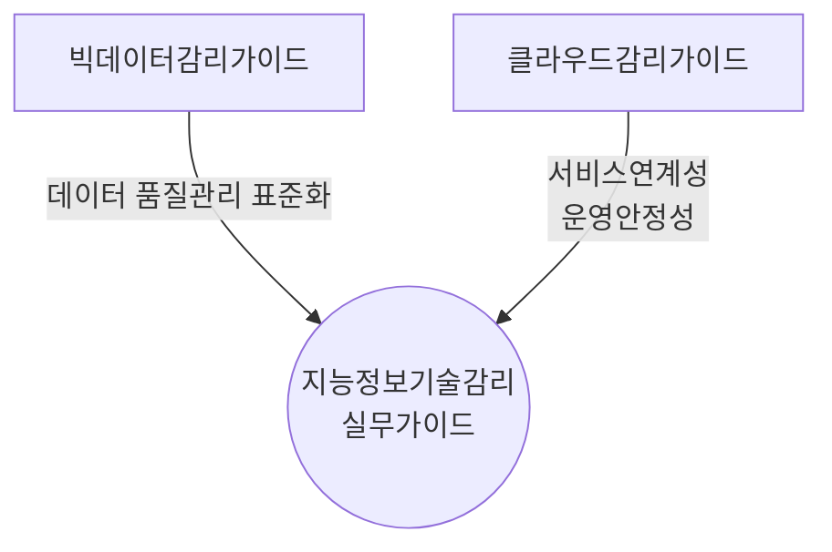
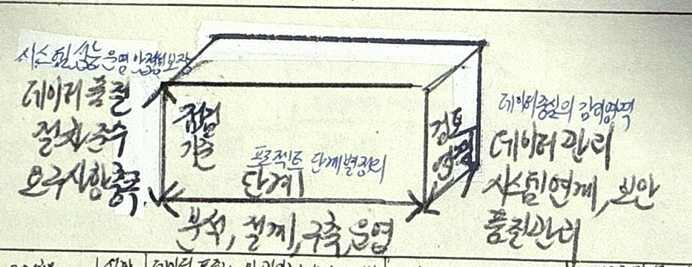

## 지능정보기술감리 실무가이드 개념

- 빅데이터를 구축하고 분석하는 정보화 사업에 대한 감리를 수행함에 있어 필요산 사업의 단계별 감리 점검항목을 제시하기 위한 실무지침
- 데이터 품질, 서비스연계점, 운영안정성 확보, 리스크 최소화, 정보시스템 신뢰성 증대

## 지능정보기술감리 실무가이드 개념도

## 빅데이터 정보화사업 점검항목

### 분석 및 설계 단계 점검항목

| 구분 | 점검항목 | 내용 |
| --- | --- | --- |
| 분석 | 빅데이터 서비스 요구사항 정의여부 | 상버목표 및 추진전략 검토 |
| | 분석목표 달성을 위한 데이터 항목 정의 | 상관관계 정의, 품질수준 설정 |
| | 요구사항 정의 과정에서 데이터 품질요소 검토 | 데이터 활용 적합성 |
| 설계 | 데이터 수집/정제 체계의 적정 설계여부 | 데이터 오류처리, 정제 기준 |
| | 데이터 저장체계 및 보유기관 간 연계 설계 | 데이터 이관절차, 주기적 수집 확인 |
| | 데이터 표준화 및 관리체계 설계여부 | 데이터 속성정의, 표준항목 관리 |

### 구축 및 운영 단계 점검항목

| 구분 | 점검항목 | 내용 |
| --- | --- | --- |
| 구축 | 데이터 생애주기 관리체계 확인 | 생성-소멸 전 과정 감리 |
| | 데이터가 설계된 대로 수집/변환되는지 점검 | 데이터 품질/변환 절차 확인 |
| | 시스템 구성요소 검증 | HW, SW 구성요소 설계 및 복구 계획 |
| 운영 | 데이터 품질, 보안, 서비스 운영 관리체게 검토 | 데이터 거버넌스 수립 여부 |
| | 로그저장 및 분석 체계 확인 | 데이터 활용패턴, 사용자 만족도 분석 |
